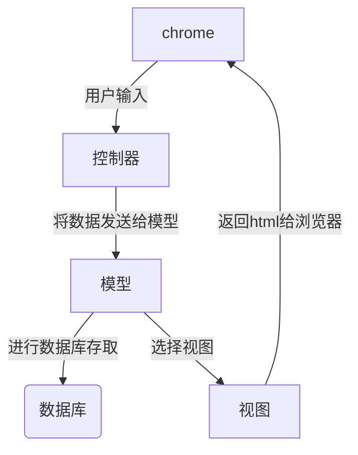
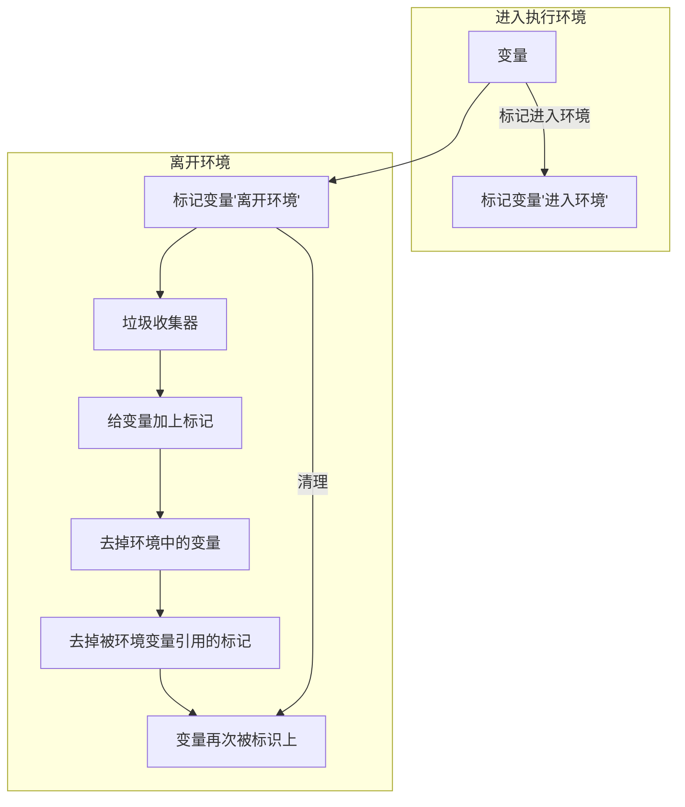

# 实习整理

## HTML面试题

### 如何理解HTML的语义化

+ 有利于让人读懂代码
+ 让搜索引擎更容易读懂，有利于SEO
+ 在没有CSS的样式下，我们也可以进行很好的展现内容结构和代码结构

### script标签中的`defer`和`async`的区别

> <script src ='xxx' ></script>
>
> 他是会阻碍HTML的解析的，他只有下载好并且执行好脚本他才会继续去解析HTML

><script src ='xxx' async ></script>
>
>解析HTML过程中进行脚本的异步下载，当脚本下载完成以后，也会立刻去执行脚本，这也是会阻碍HTML的解析

> <script src ='xxx' defer ></script>
>
> 他是绝对不会阻碍HTML解析的，他也会是边解析HTML边去下载脚本，但是他会等到HTML全部解析完成以后，再去按照顺序执行脚本


### 从输入`url`到页面展现发生了什么？

#### `DNS`域名解析

##### 什么是`DNS`

> 因为浏览器没法通过域名直接去找到对应的服务器。而是需要通过ip地址
>
> 对于浏览器来说，`DNS` 的作用就是将**主机名转换成 `IP` 地址**

##### 域名解析实现

> 通过域名查询`IP`地址或者逆向从`IP`地址反查询域名的服务
>
> `DNS`是一个应用层协议，我们发送一个请求，其中包含了我们的主机，他就会根据我们的主机名，返回对应的`IP`
>
> `DNS`也是一个大的数据库，整个`DNS`系统由分散在世界各地的很多台`DNS`服务器组成，每个`DNS`服务器上都保存着一些数据，这些数据可以让我们查到相应的主机对应的`IP`

**说白了，就是去向这些 `DNS `服务器询问，你知道这个主机名的 `IP` 是多少吗，不知道？那你知道去哪台` DNS` 服务器上可以查到吗？直到查到我想要的 `IP `为止。**

##### `DNS`服务器层次

+ 根`DNS`服务器

  例如：`www.baidu.com`,这个进行了简写，其实`www.baidu.com.`,那么他的根域名其实就是`.`

  作用

  > 管理他的下一级（顶级域`DNS`服务器）,通过查询根`DNS`服务器，我们就可以知道顶级域`DNS`服务器的`IP`是多少，然后就会像顶级`DNS`服务器进行查找

+ 顶级域`DNS`服务器

  + `com`
  + `edu`
  + `org`
  + `cn`

  作用

  > 提供顶级域`DNS`服务器的下一级（权威`DNS`服务器的`IP`地址）

+ 权威`DNS`服务器

  作用

  > 权威 `DNS` 服务器可以返回主机 - `IP `的最终映射

##### 本地`DNS`服务器

本地`DNS`服务器并不属于`DNS`的层次结构

每一个`IPS`都会有一个本地的`DNS`服务器（一个居民区的 `ISP`、一个大学的 `ISP`、一个机构的 `ISP`，都有一台或多台本地` DNS `服务器）,**当主机发送`DNS`请求时，请求先会被发送到本地的`DNS`服务器，本地的`DNS`服务器起到了一个代理的作用，他将负责请求转发到`DNS`服务器的层次结构中**

##### 域名解析方式

+ 递归查询

  > 我们的浏览器，操作系统，路由器都会缓存一些`URL`对应的`IP`地址，统称为`DNS`高速缓存
  >
  > 为了加快`DNS`解析速度，使得每次不再需要去根域名下查找

  例如：

  > 主机 `m.n.com` 向本地 `DNS` 服务器 `dns.n.com` 发出的查询就是**递归查询**，这个查询是主机 `m.n.com` 以自己的名义向本地 `DNS` 服务器请求想要的 `IP` 映射，并且本地 `DNS` 服务器直接返回映射(`IP`)结果给到主机。

+ 迭代查询

  > **局部的`DNS`服务器并不会自己向其他服务器进行查询，而是把能够解析该域名的服务器`IP`地址返回给客户端，**客户端会不断的向这些服务器进行查询，直到查询到了位置
  >
  > **所有的请求都是由本地 `DNS` 服务器发出，所有的响应都是直接返回给本地 `DNS `服务器**。

+ 浏览器如何通过域名去查询`url`对应的`IP`呢

  > `DNS`域名解析分为递归域名解析和迭代域名解析
  >
  > 我们主机向本地`DNS`服务器发出的查询就是递归查询
  >
  > 其他的后续的查询,包括本地`DNS`服务器向根`DNS`服务器发送请求，本地`DNS`服务器向顶级域`DNS`服务器发送请求，本地 `DNS` 服务器向权威 `DNS` 服务器发送查询请求

  

#### `DNS`的优化与应用

+ `DNS`缓存

  >就是将他们存起来，免得以后再次去找
  >
  >浏览器缓存，系统缓存，路由缓存，`IPS`服务器缓存，根域名服务器缓存，主域名服务器缓存

+ `DNS`负载均衡

  > 一个网站上有很多的服务器，当我们浏览器的访问量变大时，我们所有的请求不会只在一个服务器上，这样服务器很容易崩掉
  >
  > 我们需要使用负载均衡，就是**在应答`DNS`查询的时候**，**`DNS`服务器会对每个查询返回不同的解析结果（也就是他会返回不一样的`IP`地址**），这时候就会到其他的服务器上，这样服务器端压力减小

+ `CDN`

  > 其实利用的就是`DNS`的重定向技术，它会返回一个离用户最近的那个`IP`地址，这时候`CDN`就会去响应用户发送的请求，提供用户所需要的数据

+ `DNS-prefetch`

  > 大型网站，有多个不同服务器资源的情况下，都可采取`DNS`预解析，提前解析，减少页面卡顿。

#### TCP三次握手

+ 第一次：客户端向服务器发送请求，意思是告诉服务器，我要发送请求了

+ 第二次：由服务器发起，告诉客户端，我已经准备接收了，可以发送

+ 第三次：浏览器发起，告诉服务器，我马上就发送了，准备接受

  + 第一次握手可以确认客服端的`发送能力`,

  + 第二次握手，服务端`SYN=1,Seq=Y`就确认了`发送能力`,`ACK=X+1`就确认了`接收能力`
  + 第三次握手才可以确认客户端的`接收能力`。不然容易出现丢包的现象。

  

#### 发送HTTP请求

##### HTTP是什么：

> 一种可以获取像HTML这样的网络资源的通讯协议

##### 基本特性

+ HTTP是无连接的

  > 限制每次连接只会处理一条请求。服务器处理完客户的请求，并收到客户的应答后，就会断开连接

+ HTTP是可扩展的

+ HTTP是无状态的

  > 是指处理事务是没有记忆的。
  >
  > 意思就是如果后续需要前面的信息，那么我们就必须重传一次
  >
  > 好处：因为不需要前面的信息，所以我的应答速度快，我们需要借助cookie创建有状态的会话

##### HTTP消息结构

+ 请求报文

  > `HTTP`请求报文：请求行，请求头部，空行和请求数据四个部分组成

+ 响应报文

  > `HTTP`响应报文：状态行，消息报头，空行，和响应正文

##### HTTP请求方法

+ `HTTP1.0`
  + `GET`
  + `POST`
  + ``HEAD`：类似于`GET`，用于获取报头
+ `HTTP1.1`
  + `PUT`,`DELETE`,`CONNECT`

##### HTTP首部

+ 通用首部：既可以出现在请求报文，也可以出现在响应报文里
+ 请求首部：客户端向服务器发送请求时使用的首部字段
+ 响应首部：服务器向客户端返回响应报文时使用的首部字段
+ 实体首部：请求报文和响应报文部分使用的首部
+ 其他报文字段

##### HTTP状态返回码

| 状态码 | 类别         | 描述               |
| ------ | ------------ | ------------------ |
| 1XX    | 信息型状态码 | 请求正在被处理     |
| 2XX    | success      | 请求成功           |
| 3XX    | 重定向状态码 | 需要重定向         |
| 4XX    | 客户端错误   | 服务器无法请求     |
| 5XX    | 服务器错误   | 服务器处理请求出错 |

##### HTTP Cookie

+ 会话状态管理（用户登录状态，购物车，游戏分数等需要记录的信息）
+ 个性化设置（一些自定义的设置，主题等）
+ 浏览器行文跟踪

**由于服务器指定Cookie后，浏览器的每次请求都会携带Cookie数据，会带来额外的性能开销**，所以Cookie变得没那么流行

**标记为`Secure`的cookie只应通过被HTTPS协议加密过的请求发送给服务器**

**为避免跨域脚本攻击。通过`javascript`的`dodument.cookie.API`是无法访问带有`HttpOnly`标记的Cookie，他们只应该发送给服务器**

##### HTTP/1.x的连接管理(重点)

1. 短链接

   每一个HTTP请求都是由他自己独立完成，这意味着发起每一次请求之前都会有一个TCP握手，而且是连续不断的

2. 长连接

   利用`keep-alive`协议来指定一个最小的连接的保留时间，在这段时间里面会保持连接，用于重复发送请求，节省了TCP连接握手的时间

3. HTTP流水线

   已经有更好的算法来替代了`multiplexing`

   

##### 域名名片

> 已经过时了，如果你需要，可以升级到HTTP/2，HTTP/2的连接可以很好的处理并发的五优先级的请求。如果这时候使用域名名片可能会影响性能

##### HTTP缓存

缓存就是将保存资源副本，并且在下一次请求的时候，直接使用该副本

当web缓存发现请求的资源已经被存储了，那么他就会拦截请求，返回该资源的拷贝

**HTTP缓存只能存储`GET`响应，对于其他类型的响应，无能为力**

1. 缓存规则：

   > 我们认为浏览器存在一个缓存数据库，用于存储缓存信息，在浏览器第一次请求的时候，此时缓存数据库没有对应的缓存数据，则需要请求服务器，**服务器将缓存规则和数据返回，浏览器将缓存规则和数据存储进缓存数据库**

2. 强缓存

   浏览器判断本地缓存没有过期，那么就会直接使用，不发送HTTP请求

   + `HTTP1.0`

     > 在响应头字段为`Expires`值是一个时间戳，如果超过这个时间，那么缓存失效，否则都会直接从缓存数据库中获取数据

   + `HTTP1.1`

     `Cache-Control`

     | private  | 私有缓存                                       |
     | -------- | ---------------------------------------------- |
     | public   | 共享缓存                                       |
     | max-age  | 缓存的内容将在`xxx`秒后失效                    |
     | no-cache | 需要使用对比缓存来验证缓存数据                 |
     | no-store | 所有内容都不会缓存，强缓存，协商缓存都不会触发 |

    **注意：在 HTTP 1.0 版本中，`Expires` 字段的绝对时间是从服务器获取的，由于请求需要时间，所以浏览器的请求时间与服务器接收到请求所获取的时间是存在误差的，这也导致了缓存命中的误差**
   
   **在 HTTP 1.1 版本中，因为 `Cache-Control` 的值 `max-age=xxx` 中的 xxx 是以秒为单位的相对时间，所以在浏览器接收到资源后开始倒计时，规避了 HTTP 1.0 中缓存命中存在误差的缺点，为了兼容低版本 HTTP 协议，正常开发中两种响应头会同时使用，`HTTP 1.1 版本的实现优先级高于 HTTP 1.0`。**

3. 协商缓存

   > 浏览器第一次请求数据时，服务器会将缓存标识和数据一起返回给客户端，客户端将两者备份至缓存数据库中，**再次请求数据时，客户端将备份的缓存标识发送给服务器**，服务器根据缓存标识进行判断，**判断成功后，返回304状态码**，告诉客户端比较成功，使用缓存数据

   + `HTTP1.0`

     > **If-Modified-Since/Last-Modified** 这两个是成对出现的，属于协商缓存的内容，其中**浏览器的头部是`If-Modified-Since`**，而**服务端的是`Last-Modified`**，它的作用是，在发起请求时，**如果If-Modified-Since和Last-Modified匹配，那么代表服务器资源并未改变，因此服务端不会返回资源实体，而是只返回头部，通知浏览器可以使用本地缓存。****Last-Modified，顾名思义，指的是文件最后的修改时间**，而且只能`精确到1s以内`。

   + `HTTP1.1`

     > **If-None-Match/E-tag** 这两个是成对出现的，属于协商缓存的内容，其中**浏览器的头部是`If-None-Match`，而服务端的是`E-tag`**，同样，**发出请求后，如果If-None-Match和E-tag匹配，则代表内容未变，通知浏览器使用本地缓存**,**和Last-Modified不同，E-tag更精确，**它是类似于指纹一样的东西，基于`FileEtag INode Mtime Size`生成，只要文件变，指纹就会变，而且`没有1s精确度的限制`。

     ```mermaid
     graph LR;
         A(浏览器请求)-->B{是否有缓存};
         B--没有-->C[向服务器发送请求];
         B--有-->F{是否过期}
         F--否-->G[从缓存中读取]
         F-->H{Etag?}
         H--有-->J[向服务器发送if-None-Match]
         J-->L{服务器决策}
         F-->I{Last-Modified?}
         I--有-->K[向服务器发送if-Modified-Since]
         K-->L{服务器决策}
         L-->M[返回304]
         M-->G
         G-->D
         L--有更新-->N[返回200响应内容]
         N-->E
         C-->D[返回响应内容];
         D-->E(显示);
     ```

#### 服务器处理请求并返回HTTP报文



#### 浏览器解析页面

1. 多进程的浏览器

   > 浏览器是多进程的，有一个主控进程，以及每一个tab页面都会新开一个进程（某些情况，多个tab会合并为一个进程）

   进程：

   + `Browser`进程：浏览器的主控进程(负责协商，主控)。**只有一个Browser进程**
   + 第三方插件进程:每种类型的插件对应一个进程，**仅当使用该插件时才会被创建**
   + `GPU`进程：最多一个，用于3D绘制
   + 浏览器渲染进程(浏览器内核)：默认每一个Tab页面一个进程，互不影响，控制页面渲染，脚本执行，事件处理等（有时候可以多个tab变为一个进程）

2. 多线程的浏览器内核

   每一个tab页面可以看作时浏览器的内核进程，然后这个进程时多线程的

   + `GUI`线程
   + `JS`引擎线程
   + 事件触发线程
   + 定时器线程
   + 网络请求线程

##### 渲染步骤

   浏览器内核拿到内容后，渲染步骤大致可以分为

   1. 解析`HTML`，创建`DOM`树
   2. 解析`CSS`，生成`CSS`规则树
   3. 合并`DOM`树和`CSS`规则树，生成了`render树`（渲染树）
   4. 布局`render`树(layout/reflow),负责个元素尺寸，位置的计算
   5. 绘制`render`树(paint),绘制页面像素信息

   

   **layout(回流)**：根据生成的渲染树，进行回流(layout)，**得到的节点的几何信息(位置和大小)**

   **Painting(重绘)**：根据渲染树以及回流得到的几何信息，得到节点的绝对像素

   **Display**:将像素发送给`GPU`，展示在页面上

##### 生成渲染树

1. 从DOM树的根节点开始遍历每一个可见节点
2. 对于每一个可见节点找到对应的`CSS规则树`，并应用他们
3. 根据每一个可见节点以及其对应的样式，组合生成渲染树

#### 断开连接

> 当数据传送完毕，需要断开`TCP`,此时发起`TCP`的四次挥手

+ 第一次挥手：由浏览器发起，发给服务器，我请求的报文发送给完了，你准备关闭
+ 第二次挥手：由服务器发起，告诉浏览器，我**请求报文**接收完了，准备关闭，让浏览器也准备关闭
+ 第三次挥手：由服务器发起，告诉浏览器，我的**响应报文**发送完成，你准备关闭
+ 第四次挥手：由浏览器发起，告诉服务器，我**响应报文**接受完了，准备关闭了。

参考文章：

[从URL输入到页面展现到底发生什么]: https://juejin.cn/post/6844903784229896199	"从URL输入到页面展现到底发生什么"

## `CSS`面试题

### 盒模型介绍

1. 标准盒模型

   `width = content box width + padding + border`

   `height = content box height + padding + border`

2. `IE`(替代)盒模型

   大小就是你设置的宽高度值，如果你设置了`padding`和`border`,那么实际的大小需要减去内边距和边框

### `CSS`选择器和优先级

| 选择器       | 示例                                                         |
| ------------ | ------------------------------------------------------------ |
| 类型选择器   | h1{}                                                         |
| 通配符       | *{}                                                          |
| 类选择器     | .box{}                                                       |
| ID选择器     | #box{}                                                       |
| 属性选择器   | a[title]{}                                                   |
| 伪类选择器   | p::first-child{}                                             |
| 伪元素选择器 | p:after{}                                                    |
| 后代选择器   | article p{}                                                  |
| 子类选择器   | 元素 1 > 元素 2 {样式声明 },只会匹配作为第一个元素的**直接后代元素** |
| 相邻兄弟元素 | img+p{},意思是匹配，图片后面紧跟的段落将被选择               |
| 通用兄弟元素 | h1~p{},选择h1元素之后的所有同层级的p元素                     |

#### 优先级的计算规则

> 内联>ID选择器>类选择器>标签选择器

优先级是由`A`,`B`,`C`,`D`的值来决定的

1. 当出现内联样式时,`A` = 1,否则`A` = 0
2. `B`的值等于`ID`选择器出现的次数
3. `C`的值等于`类选择器`和`属性选择器`和`伪类`的出现总次数
4. `D`的值等于`标签选择器`和`伪元素`出现的次数

**从左往右依次进行比较 ，较大者胜出，如果相等，则继续往右移动一位进行比较 。如果4位全部相等，则后面的会覆盖前面的**

#### 优先级特殊情况

`!important`，它可以覆盖内联样式，但是我们尽量不要使用

什么时候`!important`不起作用

```html
<div class="box" style="background: #f00; width: 300px!important;">我的宽度是多少呢？？<div>
```

```css
.box {
	max-width: 100px;
}
```

这时候你的样式是没法生效的，因为`max-width`和`width`不是一个属性

**优先级，是来比较相同属性的**

### 重排(reflow)和重绘(repaint)的理解

重排：

> 无论通过什么方式影响了元素的几何信息(元素在视图的位置和尺寸)，浏览器需要**重新计算**元素在视图内的几何属性

重绘：

> 通过渲染树和重排(回流)阶段，我们知道哪些节点是可见的，以及那些样式和具体的几何信息，接下来就可以将渲染树的每个节点转为屏幕上的**实际像素**

如何减少重排和重绘？

+ 最小化重绘和重排

  > 样式集中改变，使用增加新样式类名`.class`

  例子

  ```javascript
  const el = document.getElementById('test');
  el.style.padding = '5px';
  el.style.borderLeft = '1px';
  el.style.borderRight = '2px';
  ```

  这里面大量的直接操作DOM元素，我们可以将他们进行合并

  + 使用`CSSText`

    ```javascript
    const el = document.getElementById('test')
    el.style.cssText += 'border-left: 1px; border-right: 2px; padding: 5px;'
    ```

  + 修改`class`，为他们添加`class`

    ```javascript
    const el = document.getElementById('test')
    el.className +='active'

+ 批量操作`DOM`

  + 使用`absolute`和`fixed`和`float`可以脱离文档流

    > 在制作复杂动画时对性能的影响比较明显

  + 对元素进行多次修改

  + 将元素带回到文档中

+ 开启`GPU`加速

  > 利用`css`属性`transform`,`will-change`等，比如改变元素位置，我们使用`translate`会比使用绝对定位改变其`left`,`top`等来的高效
  >
  > **`translate`不会触发重排或重绘，`transform`会为浏览器元素创建一个`GPU图层`，这使得动画元素在一个独立的层中进行渲染**
  
  - 使用`css3`硬件加速，可以让`transform`、`opacity`、`filters`这些动画不会引起回流重绘
  - 对于动画的其它属性，比如`background-color`这些，还是会引起回流重绘的，不过它还是可以提升这些动画的性能。

#### 回流重绘

   

   **layout(回流)**：根据生成的渲染树，进行回流(layout)，**得到的节点的几何信息(位置和大小)**

   **Painting(重绘)**：根据渲染树以及回流得到的几何信息，得到节点的绝对像素

   **Display**:将像素发送给`GPU`，展示在页面上

#### 生成渲染树

1. 从DOM树的根节点开始遍历每一个可见节点
2. 对于每一个可见节点找到对应的`CSS规则树`，并应用他们
3. 根据每一个可见节点以及其对应的样式，组合生成渲染树

**补充**

1. 什么是可见节点，什么是不可见节点

   不可见节点

   + 一些不会渲染的节点,包括`script`,`meta`,`link`
   + 一些通过`css`进行隐藏的节点。**`display:none,节点是不会渲染到渲染树上的，但是和他相同效果的visibility和opacity即使是隐藏了，但是还是会显示在渲染树上的`**

2. 何时发生回流和重绘

   **回流一定会触发重绘，但是重绘不一定会触发回流**

   只有当页面布局和几何信息发生变化，就需要回流

   + 删除或者增加`DOM`元素
   + 元素的位置发生变化
   + 元素的尺寸发生了变化(包括页边距，内边框，边框大小，高度和宽度等)
   + 页面内容发生了变化(文本的变化，图片被替代等)
   + 页面一开始渲染
   + 浏览器窗口尺寸发生了变化(**回流是根据视口的大小来计算元素的位置和大小的**)

#### 浏览器的优化策略

因此大多数浏览器都会通过**队列化修改并批量执行来优化重排过程**。浏览器会将修改操作放入到队列里，直到**过了一段时间或者操作达到了一个阈值，才清空队列**。

**但是，当你去获取页面的布局信息的时候，他还是会强制刷新队列的，这就会造成重排**

+ `offsetTop`、`offsetLeft`、`offsetWidth`、`offsetHeight`
+ `scrollTop`、`scrollLeft`、`scrollWidth`、`scrollHeight`
+ `clientTop`、`clientLeft`、`clientWidth`、`clientHeight`
+ `getComputedStyle()`
+ `getBoundingClientRect`

**最好避免使用上面列出的属性，他们都会刷新渲染队列。**如果要使用它们，最好将值缓存起来

### 对`BFC`的理解

#### `BFC`具有一些特性

1. 块级元素会在垂直方向上面一个接一个的排列，和文档流的排列方式一致
2. 在`BFC`中上下相邻的两个容器的`margin`会重叠，可以创建新的`BFC`来避免外边距重叠
3. 计算`BFC`的高度时，需要计算浮动元素的告诉
4. `BFC`区域不会和浮动的容器发生重叠
5. `BFC`是一个独立的容器，容器内部元素不会影响外部元素
6. 每个元素的左`margin`和容器的左`border`接触

#### 包含块（containing block）

> 其实就是一个矩形的边界

```html
<table>
    <tr>
        <td></td>
    </tr>
</table>
```

这段代码中：`table`和`tr`都是包含块，其中`table`是`tr`的包含块，`tr`是`td`的包含快

**盒子不会受到包含块的影响，当盒子的布局跑到包含块的外边时，就是溢出`overflow`**

#### 盒子分类

+ 块级盒
+ 行内盒
+ 匿名盒

##### 块级元素

> `css`的属性值`display`为`block`,`list-item`,`table`的元素

##### 块级盒

+ 每一个块级元素都至少有一个块级盒，也就是`css`的属性值为`display`为`block`,`list-item`,`table`
+ 块级盒子和块级元素一样，呈现的是竖直排列的块
+ 每一个块级盒都会参与`BFC`的创建
+ 一般来说，一个块级元素会生成一个块级盒子，但是也有块级元素会生成两个块级盒子，例如`li`,他就会有一个用来存放项目符号

##### 行内级元素

> `css`属性值`display`为`inline`,`inline-block`,`inline-table`的元素

##### 行内盒子

+ `css`属性值为`display`为`inline`,`inline-block`,`inline-table`,他就是行内级元素
+ 视觉上，行内盒与其他行内级元素排列为多行
+ 所有的可以替代元素(`display`为`inline`,如``,`<video>`等)生成的盒子都是行内盒子
+ 所有的非可替代行内元素(`display`值为`inline-block`或者`inline-table`)生成的盒子称为原子行内级盒子

##### 匿名盒

```html
<div>
  匿名盒1
  <p>块盒</p>
  匿名盒2
</div>
```

也就是没有被标签元素所包围的

#### 定位方案

> 定位方案包括`普通流`（Normal Flow，也叫常规流，正常布局流），`浮动`（Float），`定位技术`（Position）

##### 普通流

> 当`position`为`static`或`relative`且`float`为`none`时会触发普通流

+ `BFC`中,盒子都是**竖着**排列
+ `IFC`中,盒子都是**横着**排列
+ 静态定位中(`position`为`static`)，盒的位置就是普通流里布局的位置
+ 相对定位中(`position`为`relative`),盒子的偏移位置由`top`,`right`,`left`,`bottom`定义，**即使有偏移，仍然保留原有的位置，其它普通流不能占用这个位置**

##### 浮动

+ 浮动定位中，盒称为浮动盒
+ 盒位于当前行的开头或者结尾
+ 普通盒会环绕在浮动盒周围,除非设置`clear`属性

##### 定位技术

> 允许我们将一个元素从它在页面的原始位置**准确移动**到其他位置

###### 静态定位

> `position` 为 `static`，此时元素处于`普通流`中

###### 相对定位

>  相对定位通常用来对布局进行微调。
>
> 设置 `top`，`right`，`bottom`，`left`,设置相对于**自身的偏移量**

###### 绝对定位

> `position`为`absolute`，盒子会从普通流中移除

+ `position` 为 `absolute` 或 `fixed` 时，它是绝对定位元素,他们是会**脱离文档流的**
+ `top`，`right`，`bottom`，`left` ，设置其**相对于包含块的偏移量**
+ 子绝父相，否则就相对于`body`

###### 固定定位

> 和绝对定位类似，但是它的包含块时浏览器视窗

#### 块级格式上下文

##### `BFC`创建

+ 根元素(`<html>`)
+ 浮动元素(`float`不为`none`)
+ 绝对定位元素(`position`为`absolute`或者`fixed`)
+ 表格的标题和单元格(`display` 为 `table-caption`，`table-cell`)
+ 行内块元素(`display`为`inline-block`)
+ `overflow`的值不为`visible`的元素
+ 弹性元素(`display`为`flex`或`inline-flex`的直接子元素)
+ 网格元素（`display` 为 `grid` 或 `inline-grid` 的元素的直接子元素）

##### `BFC`的应用

###### 自适应多栏布局

```html
<div class="wrapper">
   <div class="left"></div>
   <div class="right"></div>
   <div class="main"></div>
 </div>
```

```css
.wrapper div{
    height:200px
}
//三栏布局
.left{
    float:left;
    width:200px;
    background:gray
}
.right{
    float:right;
    width:200px;
    background:gray
}
//中间设置自适应
.main {
  /* 中间栏创建 BFC */
  /* 由于 盒子的 margin box 的左边和包含块 border box 的左边相接触 */
  /* 同时 BFC 区域不会和浮动盒重叠，所以宽度会自适应 */
  overflow: auto;
  background: cyan;
}
```

###### 防止外边距折叠

原本在普通文档流中，左右/上下`margin`他们是会折叠的

###### 消除浮动

因为创建了`BFC`以后，那么我们的浮动元素的高度也会进行计算，这时候你就算不设置父元素的宽度他也会被里面的子元素撑开

```html
<div class="bfc">
  <div class="float"></div>
  <div class="inner"></div>
</div>
```

```css
.bfc {
  /* 计算 BFC 高度时，包含 BFC 内所有元素，即使是浮动元素也会参与计算 */
  /* 这一特性可以用来解决浮动元素导致的高度塌陷 */
  /* 尝试注释掉 overflow: auto，看效果 */
  /* 如果父元素没有创建 BFC，在计算高度时，浮动元素不会参与计算，此时就会出现高度塌陷 */
  overflow: auto;
  background: gray;
}

.float {
  float: left;
  width: 100px;
  height: 80px;
  background: green;
}

.inner {
  height: 50px;
  background: yellow;
}

```

### 实现两栏布局

>  左侧固定+右侧自适应

利用浮动，左边元素宽度固定，设置向左浮动。

1. **将右边元素`margin-left`设为固定宽度**

```html
<div class="outer">
  <div class="left">左侧</div>
  <div class="right">右侧</div>
</div>
```

```css
.outer div{
  height:200px
}
.left{
  float:left;
  width:200px;
  height:100%;
  background-color:gray
}
.right{
  margin-left: 200px;
  height: 100%; 
  background: lightseagreen;
}
```

2. 利用`flex`布局，左边元素固定宽度，右边元素设置`flex:1`

```css
.outer{
  display:flex;
  height:200px
}
.left {
  float: left;
  width: 200px;
  /*   height:100%; */
  background-color: gray;
}
.right {
  flex:1;
  /*   height: 100%; */
  background: lightseagreen;
}
```

> `flex:1`,经常用于自适应，将父容器的`display:flex`，侧边栏大小固定后，将内容区`flex:1`,可以自动放大占满剩余空间

3. 使用绝对定位，父级元素设为相对定位。左边元素`absolute`定位，宽度固定，右边元素的`margin-left`的值设置为左边元素的宽度值

```css
.outer div{
  height:200px
}
.outer{
  position:relative
}
.left {
  position:absolute;
  top:0;
  left:0;
  width: 200px;
  background-color: gray;
}
.right {
  margin-left:200px;
  background-color: skyblue;
}
```

### 实现三栏布局

> 实现圣杯布局和双飞翼布局

+ **三栏布局，中间一栏最先加载和渲染**
+ 两栏内容固定，中间随着内容自适应
+ 一般用于`PC端`

**三栏效果的总结**

+ 使用`float`布局

+ 两侧使用`margin`负值，以便和中间的内容横向重叠

  区别

  + 圣杯：用的是`padding`
  + 双飞翼：用的是`margin`

#### 圣杯布局

```html
<div id="container" class="clearfix">
  <p class="center">我是中间</p>
  <p class="left">我是左边</p>
  <p class="right">我是右边</p>
</div>
```

```css
//圣杯布局使用的padding，主要是为了防止中间内容被两侧覆盖
//然后左右的padding，等会用左右两个内容区来填满
#container {
  padding-left: 200px;
  padding-right: 200px;
  overflow: auto;
}
//浮动
#container p {
  float: left;
}
.center {
//中间实现自适应
  width: 100%;
  background-color: lightcoral;
}
//使用margin负值来使和中间内容接在一起
.left {
  width: 200px;
  position: relative;
  left: -200px;
  margin-left: -100%;
  background-color: lightcyan;
}
.right {
  width: 200px;
  margin-right: -200px;
  background-color: lightgreen;
}
```

#### 双飞翼布局

```html
<div id="main" class="float">
  <div id="main-wrap">main</div>
</div>
<div id="left" class="float">left</div>
<div id="right" class="float">right</div>
```

```css
/* 使用float布局 */
.float {
  float: left;
}
#main {
  width: 100%;
  background-color: lightpink;
}
/* 双飞翼中间使用的是margin */
#main-wrap {
  margin-left: 200px;
  margin-right: 200px;
}
/* 左右两个内容区，使用margin负值和中间接壤 */
/* 左右两侧设置宽度 */
#left{
  width:200px;
  background:skyblue;
  margin-left:-100%;
}
#right{
  width:200px;
  background:gray;
  margin-left:-200px;
}
```

**补充**

> 上述的`margin-left:100%`,是相对于父元素的`content`宽度，即不包含padding，border的宽度

### 实现水平垂直居中

1. 使用`flex`布局

```html
<div class="parent">
  <div class="son">
    son
  </div>
</div>
```

```css
.parent{
  display:flex;
  justify-content: center;
  align-items: center;
  border:1px solid black;
  width:500px;
  height:200px;
}
```

2.使用`绝对定位`,设置`top`,`left`

```css
.parent{
  position:relative;
  border:1px solid black;
  width:500px;
  height:200px;
}
.son{
  position:absolute;
  top:50%;
  left:50%;
  transform:translate(-50%,-50%)
}
```

3.使用`绝对定位`，子元素所有方向为`0`,将`margin`设置为`auto`,要求盒子有宽高

```css
.parent{
  position:relative;
  border:1px solid black;
  width:500px;
  height:200px;
}
.son{
  position:absolute;
  top:0;
  left:0;
  bottom:0;
  right:0;
/*   margins设置为auto */
  margin:auto;
/*  对子设置宽高  */
  width:50px;
  height:50px
}
```

### `flex`布局

理解`flex:1`

+ `flex-grow:1`:
  + 属性默认为`0`,如果存在剩余空间，元素也不会放大
  + 设置为`1`,代表，设置的那个会被放大，等比放大那种
+ `flex-shrink:1`
  + 默认值为`1`,如果空间不足，元素缩小
+ `flex-basis:0%`
  + 浏览器根据这个属性来**计算是否有多余的空间**
  + 设置为 `0%` 之后，因为有 `flex-grow` 和 `flex-shrink` 的设置会自动放大或缩小

### `line-height`如何继承

+ 父元素的`line-height`写了**具体的值**，比如`30px`，那么子元素`line-height`也会直接继承这个值
+ 父元素的`line-height`写了**比例**，比如`1.5`,那么子元素的`line-height`也会是继承该比列
+ 父元素的`line-height`写的是**百分数**，比如`200%`,那么子元素`line-height`继承的是**父元素`font-size*200%`**计算出来的值

## `JavaScript面试题`

### 数据类型类

#### 数据类型的介绍

+ 原始类型

  + `undefined`

  + `null`

  + `String`

  + `BigInt`：可以表示任意大小的整数

  + `Symbol`:表示独一无二的值，用于定义对象的唯一属性

  + `Number`

  + `Boolean`

+ 对象类型

  + `Object`
    + `基本Object`
    + `Array`
    + `Function`

一般**值类型(基本数据结构)**都是存放在**栈空间**里面的

```javascript
let a = 1;
let b = a;
a =2;
console.log(b)//1
```

一般**引用类型**都是存放在**堆空间**里面的，在**栈**里面存放的是**内存地址**，具体的值，我们需要去对应的**堆空间**的对应地址去取值

```javascript
let a= ={age:20}
let b = a;//他们用的是一个内存地址
b.age = 30;
console.log(a.age)//30
```


#### 数据类型的判断

1. `typeof`

   > 只能判断所有的**值类型，函数**，不可以对**null，对象，数组**进行精准判断，因为他们只会返回**Object**
   
   **除函数外所有的引用类型都会被判定为`object`**

```javascript
typeof undefined //undefined
typeof Number//Number
typeof function(){}//function
typeof 12345689n//bigInt
typeof Symbol("foo")//Symbol
typeof true//Boolean
//不可判断,数组，对象，null
typeof null//Object
typeof []//Object
typeof {}//Object
```

2. `instanceof`

   > 能判断**对象类型**，不可以判断基本数据类型
   >
   > **其内部是在判断原型链上能否找到该类型的原型**

```javascript
class People {}
class Student extends People {}
const vortesnail = new Student();
console.log(vortesnail instanceof People); // true
console.log(vortesnail instanceof Student); // true
//顺着原型链，可以找到的，我们都返回true
```

3. `Object.prototype.toString.call()`

   > 所有的原始数据都可以判断
   >
   > 它还可以判断**Date对象**或者**Error对象**

```javascript
Object.prototype.toString().call(2);//"[object NUmber]"
Object.protutype.toString().call("");//"[object String]"
Object.prototype.toString.call(true); // "[object Boolean]"
Object.prototype.toString.call(undefined); // "[object Undefined]"
Object.prototype.toString.call(null); // "[object Null]"
Object.prototype.toString.call(Math); // "[object Math]"
Object.prototype.toString.call({}); // "[object Object]"
Object.prototype.toString.call([]); // "[object Array]"
Object.prototype.toString.call(function () {}); // "[object Function]"
```

**如何判断变量为数组**

```javascript
Object.prototype.toString().call(arr);//[object Array]
//使用instanceOf
arr instanceOf Array //true
//使用isArray()
Array.isArray(arr)//true
//在原型上找
arr.__prototype__ === Array//true
```

#### 为什么区分原始数据类型和对象类型

##### 不可变性

> 原始类型，当他们被赋值以后，值本身就不会改变

```javascript
var str = 'summer';
str.slice(1);//他只会提取某个字符串的一部分，并返回新的字符串，不会改变原字符串
str.substr(1);//弃用
str.trim();//删除两头的空白字符串
str.toLowerCase();//变为小写
str[0] = 1;//直接赋值
console.log(str)//summer，不会改变值
```

**我们调用的方法，都会在原来的基础上生成一个新的字符串，而不是直接去改变字符串**

```javascript
str += '6'
console.log(str);  // summer6
```

原理：

执行`str+=6`的操作，实际上是在栈中又开辟了一块内存空间用于存储`summer6`,然后将变量`str`指向这块空间

在`javascript`中每一个变量都需要一个空间来存储

内存空间分为两种：`堆内存`和`栈内存`

**栈内存**

+ 栈内存的值大小固定：因为**栈内存空间大小固定**，所以**栈里面的变量就是不可变的**
+ 空间较小
+ 可以直接操作其保存的值
+ 系统自动分配存储空间

**JavaScript中原始类型的值全部都在栈内存中，在定义变量的时候，就一个分配好了空间**

**堆内存**

+ 存储的值可以动态调整
+ 空间较大，运行效率低
+ 无法直接操作内部存储，使用引用地址读取
+ 通过代码进行分配空间：栈内存的值表示的就是堆内存的空间地址

**引用类型的值实际上是存储在堆内存里面的，他在栈中只是存储里堆内存里面的地址，这个地址指向的是堆内存的值**

```javascript
var obj1 = {name:"ConardLi"}
var obj2 = {age:18}
var obj3 = function(){...}
var obj4 = [1,2,3,4,5,6,7,8,9]
```


引用类型不具有`不可变性`,所有有很多方法都可以改变他们

```javascript
obj1.name = "ConardLi6";
obj2.age = 19;
obj4.length = 0;
console.log(obj1); //{name:"ConardLi6"}
console.log(obj2); // {age:19}
console.log(obj4); // []
```

| pop()     | 删除数组的最后一个元素，改变原数组，返回被删除的元素         |
| --------- | ------------------------------------------------------------ |
| push()    | 向数组末尾添加一个或多个元素，该百年原数组，**返回新数组的长度** |
| shift()   | 将数组的第一个元素删除，改变原数组，**返回删除的元素**       |
| reverse() | 颠倒数组中元素的顺序，改变原数组，**返回改变后的数组**       |
| sort()    | 对数组元素进行排序，改变原数组，返回该数组                   |
| unshift() | 在数组的开头添加一个或者多个元素，改变原数组，**返回数组的长度** |
| splice()  | 从数组的添加/删除项目，改变原数组，**返回被删除的元素**      |

##### 复制

原始类型

```javascript
var name = 'summer';
var name2 = name;
name2 = 'code秘密花园';
console.log(name); //summer;
```

内存中有一个变量`name`,值为`summer`。我们从变量`name`复制出一个变量`name2`,这时候内存中创建了一个新的空间，用于存储`summer`

虽然两者值都是相同的，但是两者指向的内存空间完全不同

```javascript
var obj = {name:'ConardLi'};
var obj2 = obj;//复制的是obj的栈中存储的地址
obj2.name = 'code秘密花园';
console.log(obj.name); // code秘密花园
```


当我们复制引用类型的变量时，实际上复制的是栈中存储的地址，所以复制的是栈中存储地址。所以我们改变其中国的任何一个变量，另一个变量也会受到影响。

##### 比较

```javascript
var name = 'ConardLi';
var name2 = 'ConardLi';
console.log(name === name2); // true
var obj = {name:'ConardLi'};
var obj2 = {name:'ConardLi'};
console.log(obj === obj2); // false
```

+ 对于原始类型，比较时会直接比较它们的值，如果相等，就返回`true`
+ 对于引用类型，比较时比较的是他们的**引用地址**。虽然两个变量在堆中存储的对象具有属性值都是相等的，但是它们被存储在不同的存储空间，因此比较值为`false`

##### 值传递和引用传递

```javascript
let name = 'summer';
function changeValue(name){
  name = 'code秘密花园';
}
changeValue(name);
console.log(name);//summer
```

函数打印出来的值**没有改变**，说明函数**参数传递的是变量的值**，即值传递

函数内部的操作可以改变传入的变量，那么**说明函数参数传递的是引用**，即引用传递

**这个并不是引用传递**

```javascript
let obj = {name:'summer'};
function changeValue(obj){
  obj.name = 'code秘密花园';
}
changeValue(obj);
console.log(obj.name); // code秘密花园
```

**JavaScript中所有函数的参数都是值传递**

当**函数参数为引用类型**的时候，我们同样将参数复制了一个副本给局部变量，只不过复制的这个副本是指向**堆内存的地址**，我们在函数内部对对象的属性进行操作，实际上和外部变量指向堆内存中的值相同

**当变量是原始类型时，这个副本就是值本身，当变量是引用类型时，这个副本是指向堆内存的地址**

#### `null`和`undefined`

`null`

表示被赋值过的对象，刻意把一个对象赋值为`null`

对象的某个属性值为`null`是正常的，`null`转为数值时为`0`

`undefined`

表示缺少值，此处有一个值，但是没有定义

`undefined`转为数值时为`NaN`

#### `Symbol`类型

`Symbol`特性

1. 独一无二

直接使用`Symbol()`创建`Symbol`变量

```javascript
let sym1 = Symbol();//Symbol()
let sym2 = Symbol('summer');//(Symbol(summer))
let sym3 = Symbol('summer');//(Symbol(summer))
let sym4 = Symbol({name:'summer'})
console.log(sum2 === sym3)//false,说明他创造的是独一无二的
```

**如果想要创造两个相同的`Symbol`变量，那么需要使用`Symbol.for(value)`**

```javascript
var sym1 = Symbol.for('summer');
var sym2 = Symbol.for('summer');
console.log(sym1 === sym2); // true
```

2. 他是基本数据类型

> 基本数据类型，不可以使用new关键词进行构造函数

3. 不可枚举

> 不可以使用`for..in`不能将其枚举

#### `Number`类型

1. 精度丢失

计算机中所有的数据都是`二进制`存储的，所以计算机都会先转换为`二进制`进行计算，然后再转换为`十进制`

2. JavaScript对二进制小数的存储方式
   + **小数的二进制大多数都是无限循环**
   + `JavaScript`中的`Number`是64位

#### 引用类型

`Object`

+ `Array`数组
+ `Date`日期
+ `RegExp`正则
+ `Function`函数

#### 类型转换


##### `if`语句和逻辑语句

以下情况转换为`false`其他都会转变为`true`

```javascript
null
undefined
''
NaN
0
false
```

##### 运算

**对于非`Nymber`类型运用数学运算符，会先将非`Number`转换为`Number`**

`+`运算符

+ 当一侧为`String`，那么就会认为是字符串的拼接
+ 当一侧为`Number`，里面一侧是一个基本类型，那么就会将基本类型转换为`Number`类型，进行做加法
+ 当一侧为`Number`,另一侧为引用类型，将引用类型和`Number`类转为字符串，然后进行拼接

```javascript
123+'123' = '123123'
123+null = 123//null的Number是0
123+true = 124
123+{} = 123[object object]
```

##### `==`

+ 两侧类型相同

> 会发生隐式转换

1. `NaN`

**NaN和其他任何类型比较永远返回`false`(包括和他自己)**

`NaN`和任何类型都不相同

2. `Boolean`

`Boolean`和任何类型相比，`Boolean`优先会被转化为`Number`类型

```javascript
true == 1  // true 
true == '2'  // false
true == ['1']  // true
true == ['2']  // false
```

**注意**

```javascript
undefined == false // false
null == false // false
//原因：
//==和Boolean进行比较时，Boolean都会优先判断
//undefined == false，false先变为0，但是这边nudefined没有转换为Number
```

3. `String`和`NUmber`

> `String`和`Number`进行比较，先将`String`转换为`Number`

```javascript
123 == '123' // true
'' == 0 // true
```

4. `null`和`undefined`

**`null`和`undefined`比较，都为false(不包括和自身进行比较)**

**`null`和`undefined`比较结果为`true`**

```javascript
null == undefined // true
null == '' // false
null == 0 // false
null == false // false
undefined == '' // false
undefined == 0 // false
undefined == false // false
```

+ 双方类型不同

  >  原始类型和引用类型进行比较

  **对象类型(引用类型)会被转化为原始类型**

```javascript
  '[object Object]' == {} // true
  '1,2,3' == [1, 2, 3] // true
```

```javascript
[] == ![] // true
原因：
!的权限高，![]会优先转为false，false是Boolean，也会优先转化为0，然后[]为0，所以相同
```

```javascript
[null] == false // true
[undefined] == false // true
原因
数组元素为null或者undefined时，该元素会被当作空字符串进行比较，所以[null]和[undefind]都会被转化为0
```

#### 深拷贝和浅拷贝

浅拷贝

> 如果属性是**基本类型**，拷贝的就是**基本类型的值**，如果属性是**引用类型**，拷贝的就是**内存地址** ，所以如果其中一个对象改变了这个地址，就会**影响到另一个对象。**

深拷贝

> 将一个对象**从内存中完整的拷贝**一份出来,从堆内存中开辟一个新的区域存放新对象,且**修改新对象不会影响原对象**

赋值

> 赋值赋的是该**对象在栈中的地址**
>
> 两个对象指向的是**同一个存储空间**，无论哪个对象发生改变，其实都是改变的存储空间的内容，因此，**两个对象是联动**的。

```javascript
//赋值
// 对象赋值
 var obj1 = {
    'name' : 'summer',
    'age' :  '18',
    'language' : [1,[2,3],[4,5]],
};
var obj2 = obj1;
obj2.name = "summer22";
obj2.language[1] = ["二","三"];
console.log('obj1',obj1)
console.log('obj2',obj2)
```


这边无论是基本类型还是引用类型都发生了变化

```javascript
// 浅拷贝
 var obj1 = {
    'name' : 'summer',
    'age' :  '18',
    'language' : [1,[2,3],[4,5]],
};
 var obj3 = shallowCopy(obj1);
 obj3.name = "summer22";
 obj3.language[1] = ["二","三"];
 function shallowCopy(src) {
    var dst = {};
    for (var prop in src) {
        if (src.hasOwnProperty(prop)) {
            dst[prop] = src[prop];
        }
    }
    return dst;
}
console.log('obj1',obj1)
console.log('obj3',obj3)
```


这边基本类型没有发生变化但是引用类型发生了变化，**因为对于引用类型，他拷贝的就是内存的地址**


浅拷贝代码

```javascript
function clone(target){
    let cloneTarget = {};
    for(const key in target){
        cloneTarget[key] = target[key]
        //cloneTarget.key = target.key
    }
    return cloneTarget
}
```

深拷贝

+ 如果为原始类型，不需要拷贝，直接返回
+ 如果为引用类型，那么就需要创建一个对象，一个一个的拷贝过去，直到变为原始类型
+ 但是为了防止存在自身调用自身的情况，所以我们需要额外开辟一个空间，用来判断这个对象是否已经拷贝过了，使用map来判断

```javascript
function clone(target,map = new WeakMap()){
    //首先判断类型
    if(typeof target === 'object'){
        //需要新建一个对象，然后一个一个的拷贝进去
        //let cloneTarget = {}
        //判断他是不是已经拷贝过了
        let cloneTarget = Array.isArray(target) ? [] : {}
        if(map.has(target)){
            return map.get(target)
        }
        //否则的话，将他存入map
        map.set(target,cloneTarget)
        for(const key in target){
            cloneTarget[key] = clone(target[key])
        }
        return cloneTarget
    }else{
        return target
    }
}
```

`WeakMap`

> 也是一组键/值对的集合，键必须要是一个对象，但是值可以是任何类型，它是一种弱引用

`弱引用`

一般情况下，`const obj = {}`,我们就会创建一个强引用的对象，**只有我们手动将他设置为null`obj = null`,它才会进入垃圾回收**，但是如果是**弱引用**的话，**垃圾回收会自己帮我们回收**

假如上面我们的要拷贝的对象很庞大时，`map`就会对内存造成消耗(内存溢出)，我们必须手动的清除`map`的引用，才能释放掉这块内存

### 内存类

#### 垃圾回收

> **找到不再使用的变量，然后释放掉其占用的内存**，但是过程**不是实时**的，因为他的开销比较大，所以，它是**按照一个固定的周期**执行的

```javascript
var a = "hello";//hello被a引用了
var b = "summer";//summer被b引用了
var a = b; //重写a
```

这边，代码对`a`进行了重写，那么`hello`这个字符串就会失去引用。系统检测到就会释放该字符串的空间以便这些空间可以再次被利用

##### 垃圾回收机制

> 如何知道哪些内存是不需要的

+ 标记清除(常用)
+ 引用计数

1.标记清楚



2. 引用计数

> 就是有一张引用表，保存着内存中的所有资源的引用次数。
>
> 如果这个表的引用次数为0，那么就表示这个值不会用到了，就是释放

**如果一个值不会使用了，但是引用数却不为0，那么垃圾回收机制就会无法释放这个内存，导致内存泄漏**

```javascript
let arr = [1,2,3];//[1,2,3]被arr引用，所以应用数加1
arr = [a,c,b];
//[a,c,b]被arr引用，[a,c,b]引用数加1，但是[1,2,3]失去引用，所以引用数减1，变为0
//垃圾回收机制，会将[1,2,3]的内存释放掉，但是，因为[a,c,b]的引用值不为0，所以无法回收
console.log("summer")
```

问题

> 循环引用问题

```javascript
function func{
    let obj1 = {};
    let obj2 = {};
    obj1.a = obj2;//obj2被obj1引用
    obj2.b = obj1;//obj1被obj2引用
    //当这个函数被回收后，里面的对象obj1和obj2，因为引用值不为0，所以无法回收
    //如果需要解决可以赋值为null
    obj1 = null;
	obj2 = null;
}
```

##### 引起内存泄漏

>内存泄漏：垃圾回收器一直无法回收“进入环境”的变量

1. 全局变量

```javascript
function foo(arg){
	bar = "summer"
    //这里bar没有进行声明，bar变为一个全局变量，'summer'直接被全局变量bar引用
    //直到页面关闭之前都不会被释放
}
```

`this`引起的全局变量

```javascript
function foo(){
	this.bar = 'summer'
    //因为this，是指向window的，所以只有当页面关闭，才会释放
}
foo()
```

**加上`use strict`，可以避免这种问题**

2. 计数器或者回调函数

```javascript
var someResource = getData();
setInterval(function() {
    var node = document.getElementById('Node');
    if(node) {
        // 处理 node 和 someResource
        node.innerHTML = JSON.stringify(someResource));
    }
}, 1000);
```

如果`id`为`Node`的元素从`DOM`中移除，定时器还是会存在，同时因为回调函数中包含对`someResource`的使用，所以定时器外边的`someResource`也不会被释放

3. 闭包

```javascript
function bindEvent(){
  var obj=document.createElement('xxx')//document.XXXX被obj引用了，引用值为1
  obj.onclick=function(){
    // Even if it is a empty function
  }
    //obj再次引用了function，引用值加一，但是documentXXX没有引用，value-1，那么回收
    //整个函数清理掉后，因为函数的value不为1，所以一直不会清理
}
```

> 闭包可以维持函数内局部变量，使其得不到释放

```javascript
// 将事件处理函数定义在外面
function bindEvent() {
  var obj = document.createElement('xxx')
  obj.onclick = onclickHandler
}
// 或者在定义事件处理函数的外部函数中，删除对dom的引用
function bindEvent() {
  var obj = document.createElement('xxx')
  obj.onclick = function() {
    // Even if it is a empty function
  }
  obj = null
}
```

4. 没有清理的`DOM`元素引用

```javascript
var elements = {
    button: document.getElementById('button'),
    image: document.getElementById('image'),
    text: document.getElementById('text')
};
//将每一行DOM存为一个字典树或者数组
//同样的 DOM 元素存在两个引用：一个在 DOM 树中，另一个在字典中。
function doStuff() {
    image.src = 'http://some.url/image';
    button.click();
    console.log(text.innerHTML);
}
function removeButton() {
    document.body.removeChild(document.getElementById('button'));
    // 此时，仍旧存在一个全局的 #button 的引用
    // elements 字典树种，button 元素仍旧在内存中，不能被回收。
}
```

##### 避免内存泄漏

+ 减少不必要的全局变量，或者生命周期较长的对象，及时对无用的数据进行垃圾回收
+ 注意程序逻辑，避免“死循环”
+ 避免创造太多的对象

##### 垃圾回收使用场景优化

1. 数组`Array`优化

直接`arr = []`,可以起到清空数组的作用，但是，他也在堆空间上面重新创建了一个空间用于存储`空数组`，那么就会将原来的数组对象变为一个小的内存垃圾

我们可以采用`arr.length = 0`,也能达到清理数组的目的，并且同时实现数组的重用，减少内存垃圾

```javascript
let arr = [1,2,3];//[1,2,3]被arr引用，所以应用数加1
arr = [a,c,b];
//[a,c,b]被arr引用，[a,c,b]引用数加1，但是[1,2,3]失去引用，所以引用数减1，变为0
//垃圾回收机制，会将[1,2,3]的内存释放掉，但是，因为[a,c,b]的引用值不为0，所以无法回收
console.log("summer")
//我们可以
arr.length = 0;//可以上数字清空，并且数组类型不变
//arr = [];虽然也清空了，但是在堆上面有了一个新的空数组对象
```

2. 对象尽量复用

**对象尽量复用，不能用的尽量赋值为null**

```javascript
var t = {} // 每次循环都会创建一个新对象。
for (var i = 0; i < 10; i++) {
  // var t = {};// 每次循环都会创建一个新对象。
  t.age = 19
  t.name = '123'
  t.index = i
  console.log(t)
}
t = null //对象如果已经不用了，那就立即设置为null；等待垃圾回收。
```

3. 在循环中的函数表达式，最好放在外边，能复用最好复用

```javascript
// 在循环中最好也别使用函数表达式。
for (var k = 0; k < 10; k++) {
  var t = function(a) {
    // 创建了10次  函数对象。
    console.log(a)
  }
  //最好，将函数抽离出循环，就是函数的定义放到外边去
  t(k)
}
```

```javascript
// 推荐用法
function t(a) {
  console.log(a)
}
for (var k = 0; k < 10; k++) {
  t(k)
}
t = null
```

