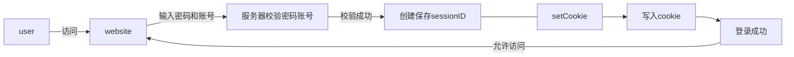
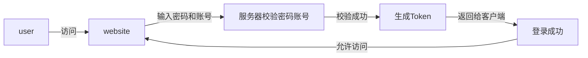
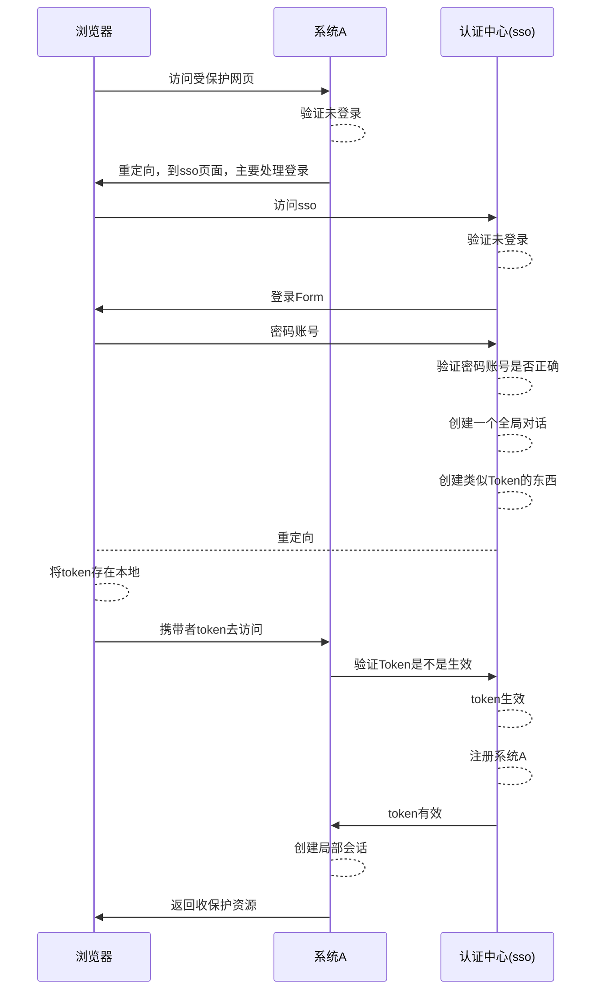
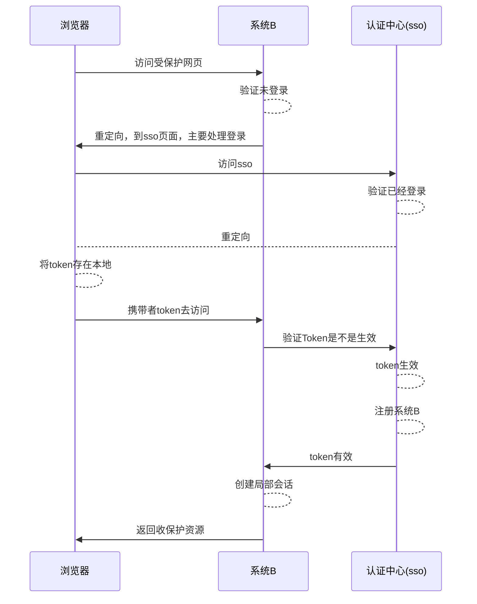

# [面试复盘]第一次面试体会

- [ ] 10.16：先了解一下登录注册功能
- [ ] 10.17：看一下深浅拷贝和跨域问题
- [ ] 10.18：看一下cookie

## 前言

鄙人，24届的前端小菜鸟，从九月份一直开始投简历，一直无人问津，奈何天无绝人之路，终于，在10.15，有一个面试官邀请我面试。害🤦‍♀️，面试官人很亲切，奈何第一次面试的小summer，属实过于拉跨。

现在将今天问到的所有题目，来整理一下，咋就是说，下次别错了。

## 题目

### 你是如何实现登陆注册的？

> 你可能会想，不就是给我们一个表单，然后提交上去，不就完了嘛，但是其实里面还是有很多东西的

#### 登录

##### 单系统登录

因为`Http`，是无状态的协议，也就是，你每一次的请求，其实都和其他的没有关系，服务器都是单独进行处理的。所以，假如你访问一些受到保护的资源，那么你就需要对请求进行鉴别。但是因为我们`Http`又是没有状态的，所以我们就需要一个状态

`seeeion+cookie`

他的流程大概就是：

+ 现在我们去进行`登录`，输入了`账号密码`
+ 然后`post`请求发送给了`服务器`
+ `服务器`去验证这个`账号密码`是不是有效
+ 如果验证成功，那么我们就会创建一个`sessionId`,并将它保存在我们的`cookie`中



+ 后续当我们在再次需要访问啥的时候，只要将这个`cookie`带上就可以直接进行身份验证
+ 就是去判断，我这个里的`sessionId`和服务器里面的是不是一致的

**其实，假如我们这种应该是对于处理同一域名下的是比较友好的，因为父域的`cookie`会被子域共享**，这时候我们其实只要将`cookie`的domain设置为父域，，同时将`path`设置为`根路径`，并且将我们获得的`sessionID`设置在父域里，那么子域就都可以访问

`token`

前面我们已经介绍了一种方法，但是这个是具有一点问题的

+ 因为我们每次用`cookie`去判断的时候，其实我们判断的都是`sessionId`，这就意味着，我们的服务器存放了很多的`sessionID`，服务器压力过大
+ 同时，如果，服务器是一个集群的话，那么每个服务器上面都需要一份相同的`sessionId`，资源浪费了

那么我们引入了第二种方法，其实他和第一种方法类似，唯一的不同，就是`Token`是不存在服务器的，他的校验，使用一个校验规则来进行校验

> Token:其实就是一个字符串，就是服务器给客户端的一块令牌，每次访问，我们都带上这个令牌




+ 首先你还是，登录，然后输入用户名密码啥的
+ 然后服务器去校验，你的密码是不是正确
+ 正确：那么，会给你生成一个`Token`,并和你返回的数据一起返回给你
+ 这个`Token`，交给了`客户端`，由客户端自己去保存
+ 意思就是，可以存在`cookie`，可以放在`localStorage`。。。

+ 后续我们访问的时候，直接带上这个`Token`就可以了

那么你可能会好奇，`token`是如何生成的，他又是如何校验的

那么我的理解是

**生成：**

关于`Token`的生成和验证，一般就是`JWT`:`JSON Web Token`

`Token`：其实由三部分组成

+ `Header`:
  + 这里面会定义一些签名的算法
+ `payload`
  + 这里面是需要传递的数据
+ `signature`
  + 这里面是根据`Header`,`payload`,`Secret(私钥)`，然后使用`Header`里面指定的签名算法生成

那么我们现在来看一个`Token`

```json
eyJhbGciOiJIUzI1NiIsInR5cCI6IkpXVCJ9.
eyJzdWIiOiIxMjM0NTY3ODkwIiwibmFtZSI6InN1bW1lciIsImFkbWluIjp0cnVlLCJpYXQiOjE1MTYyMzkwMjJ9.
i7koT2LW6XWcgOHLPqQ8nUPv16Wi5wPoF56W7FCxO7U
```

使用`jwo.io`对他进行解码

Header

```json
{
  "alg": "HS256",
  "typ": "JWT"
}
```

也就是说：

+ `typ`:令牌类型，`JWT`类型
+ `alg`:签名算法，`HS256`,这个在后续签名的时候会使用

payload:是一些你传递的数据

```json
{
  "sub": "1234567890",
  "name": "summer",
  "admin": true,
  "iat": 1516239022
}
```

其中需要注意:`iat`(`JWT`签发时间)

Signature:签名

签名其实就是对前面两个部分的前面，签名时，需要前面两个部分还有服务器自己的私钥

```json
HMACSHA256(
  base64UrlEncode(header) + "." +
  base64UrlEncode(payload),
  secret)
```

那么这些其实就是Token的生成

**校验：**

就像上面说的，每次请求的时候，都会带上这个`Token`，然后服务器就可以从`Token`中获取到你的签名函数，然后他对你的签名进行校验，判断是不是正确的

一般处理：

+ 将`token`存储在`storage`

+ 将直接放在`Header`里面

参考链接：[虾皮二面：什么是 JWT? 如何基于 JWT 进行身份验证？ - 简书 (jianshu.com)](https://www.jianshu.com/p/6b79b2f95ce6)

##### 多系统登录

`sso`单点登录

> 用户只需要登录一次，就可以访问但其他相互信任的应用系统

简单来说：

> 天猫淘宝都是属于阿里旗下的，当一个用户登录了天猫，这时候他在打开淘宝，可能就不再需要登录了

其实关于我对`sso`的理解：

> 当我去第一次访问一个受保护地址的时候，这时候呢，我不是需要登录嘛，那我会给你重定向到哪个专门处理登录的网页上，然后你去进行登录啥的，这时候它也会返回给你`Token`类似的东西，然后你重定向到原来需要浏览的网页，然后去检查`Token`,然后去获取数据之类的
>
> 但你下次去访问同一系统下其他网站的保护资源的时候，这时候也会重定向到那个登录页面，但是因为我们这时候是携带`Token`这种的，所以我们就可以不要登录，直接返回到原来页面



这样下次我们访问同一系统下的页面的时候，直接拿着那个`Token`就可以了

但是当我们去访问不同的系统呢



其实也很好理解：就是我之前已经登录过了，那么我就可以跳过那个登录的那步

那么我们怎么处理退出呢

其实很简单，就是请求一下那个`sso`的退出`api`就可以了

<!--

### 谈谈你对深拷贝浅拷贝的理解，实现一个深拷贝呢

### 你对跨域问题是怎么处理的，谈谈你的解决方案

### 你对cookie了解多少，实际运用过吗？

### 场景：

> 因为图片没有加载好，所以他下面的文字会移到上面去，当时图片加载好了，文字又会回到原来位置，这个怎么造成的？

## 总结

-->
