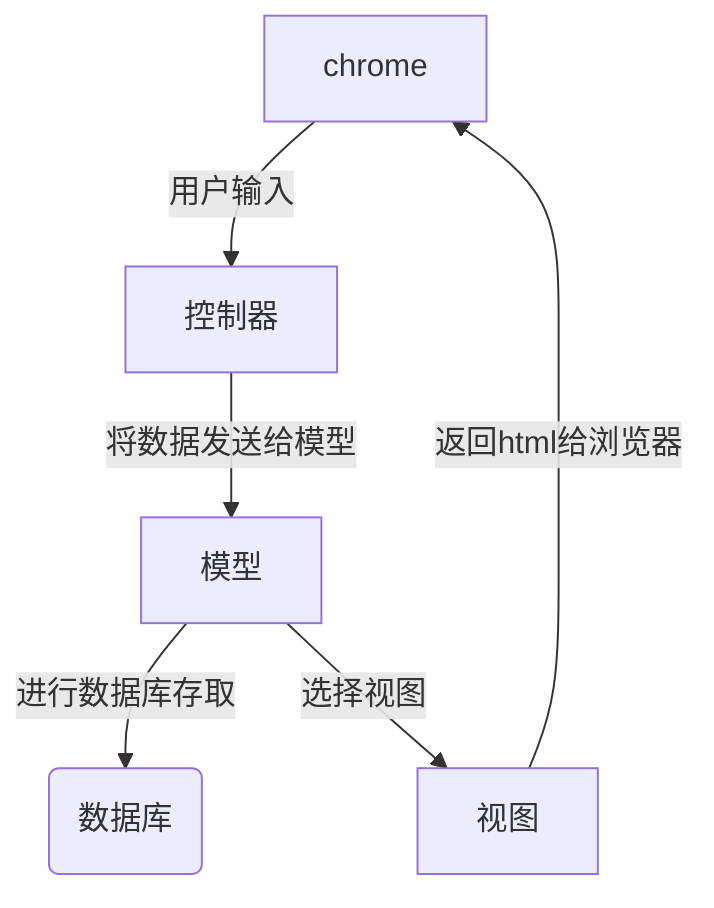

## HTML面试题

### 如何理解HTML的语义化

+ 有利于让人读懂代码
+ 让搜索引擎更容易读懂，有利于SEO
+ 在没有CSS的样式下，我们也可以进行很好的展现内容结构和代码结构

### script标签中的`defer`和`async`的区别

> <script src ='xxx' ></script>
>
> 他是会阻碍HTML的解析的，他只有下载好并且执行好脚本他才会继续去解析HTML

><script src ='xxx' async ></script>
>
>解析HTML过程中进行脚本的异步下载，当脚本下载完成以后，也会立刻去执行脚本，这也是会阻碍HTML的解析

> <script src ='xxx' defer ></script>
>
> 他是绝对不会阻碍HTML解析的，他也会是边解析HTML边去下载脚本，但是他会等到HTML全部解析完成以后，再去按照顺序执行脚本


### 从输入`url`到页面展现发生了什么？

#### `DNS`域名解析

##### 什么是`DNS`

> 因为浏览器没法通过域名直接去找到对应的服务器。而是需要通过ip地址
>
> 对于浏览器来说，`DNS` 的作用就是将**主机名转换成 `IP` 地址**

##### 域名解析实现

> 通过域名查询`IP`地址或者逆向从`IP`地址反查询域名的服务
>
> `DNS`是一个应用层协议，我们发送一个请求，其中包含了我们的主机，他就会根据我们的主机名，返回对应的`IP`
>
> `DNS`也是一个大的数据库，整个`DNS`系统由分散在世界各地的很多台`DNS`服务器组成，每个`DNS`服务器上都保存着一些数据，这些数据可以让我们查到相应的主机对应的`IP`

**说白了，就是去向这些 `DNS `服务器询问，你知道这个主机名的 `IP` 是多少吗，不知道？那你知道去哪台` DNS` 服务器上可以查到吗？直到查到我想要的 `IP `为止。**

##### `DNS`服务器层次

+ 根`DNS`服务器

  例如：`www.baidu.com`,这个进行了简写，其实`www.baidu.com.`,那么他的根域名其实就是`.`

  作用

  > 管理他的下一级（顶级域`DNS`服务器）,通过查询根`DNS`服务器，我们就可以知道顶级域`DNS`服务器的`IP`是多少，然后就会像顶级`DNS`服务器进行查找

+ 顶级域`DNS`服务器

  + `com`
  + `edu`
  + `org`
  + `cn`

  作用

  > 提供顶级域`DNS`服务器的下一级（权威`DNS`服务器的`IP`地址）

+ 权威`DNS`服务器

  作用

  > 权威 `DNS` 服务器可以返回主机 - `IP `的最终映射

##### 本地`DNS`服务器

本地`DNS`服务器并不属于`DNS`的层次结构

每一个`IPS`都会有一个本地的`DNS`服务器（一个居民区的 `ISP`、一个大学的 `ISP`、一个机构的 `ISP`，都有一台或多台本地` DNS `服务器）,**当主机发送`DNS`请求时，请求先会被发送到本地的`DNS`服务器，本地的`DNS`服务器起到了一个代理的作用，他将负责请求转发到`DNS`服务器的层次结构中**

##### 域名解析方式

+ 递归查询

  > 我们的浏览器，操作系统，路由器都会缓存一些`URL`对应的`IP`地址，统称为`DNS`高速缓存
  >
  > 为了加快`DNS`解析速度，使得每次不再需要去根域名下查找

  例如：

  > 主机 `m.n.com` 向本地 `DNS` 服务器 `dns.n.com` 发出的查询就是**递归查询**，这个查询是主机 `m.n.com` 以自己的名义向本地 `DNS` 服务器请求想要的 `IP` 映射，并且本地 `DNS` 服务器直接返回映射(`IP`)结果给到主机。

+ 迭代查询

  > **局部的`DNS`服务器并不会自己向其他服务器进行查询，而是把能够解析该域名的服务器`IP`地址返回给客户端，**客户端会不断的向这些服务器进行查询，直到查询到了位置
  >
  > **所有的请求都是由本地 `DNS` 服务器发出，所有的响应都是直接返回给本地 `DNS `服务器**。

+ 浏览器如何通过域名去查询`url`对应的`IP`呢

  > `DNS`域名解析分为递归域名解析和迭代域名解析
  >
  > 我们主机向本地`DNS`服务器发出的查询就是递归查询
  >
  > 其他的后续的查询,包括本地`DNS`服务器向根`DNS`服务器发送请求，本地`DNS`服务器向顶级域`DNS`服务器发送请求，本地 `DNS` 服务器向权威 `DNS` 服务器发送查询请求

  

#### `DNS`的优化与应用

+ `DNS`缓存

  >就是将他们存起来，免得以后再次去找
  >
  >浏览器缓存，系统缓存，路由缓存，`IPS`服务器缓存，根域名服务器缓存，主域名服务器缓存

+ `DNS`负载均衡

  > 一个网站上有很多的服务器，当我们浏览器的访问量变大时，我们所有的请求不会只在一个服务器上，这样服务器很容易崩掉
  >
  > 我们需要使用负载均衡，就是**在应答`DNS`查询的时候**，**`DNS`服务器会对每个查询返回不同的解析结果（也就是他会返回不一样的`IP`地址**），这时候就会到其他的服务器上，这样服务器端压力减小

+ `CDN`

  > 其实利用的就是`DNS`的重定向技术，它会返回一个离用户最近的那个`IP`地址，这时候`CDN`就会去响应用户发送的请求，提供用户所需要的数据

+ `DNS-prefetch`

  > 大型网站，有多个不同服务器资源的情况下，都可采取`DNS`预解析，提前解析，减少页面卡顿。

#### TCP三次握手

+ 第一次：客户端向服务器发送请求，意思是告诉服务器，我要发送请求了

+ 第二次：由服务器发起，告诉客户端，我已经准备接收了，可以发送

+ 第三次：浏览器发起，告诉服务器，我马上就发送了，准备接受

  + 第一次握手可以确认客服端的`发送能力`,

  + 第二次握手，服务端`SYN=1,Seq=Y`就确认了`发送能力`,`ACK=X+1`就确认了`接收能力`
  + 第三次握手才可以确认客户端的`接收能力`。不然容易出现丢包的现象。

  

#### 发送HTTP请求

##### HTTP是什么：

> 一种可以获取像HTML这样的网络资源的通讯协议

##### 基本特性

+ HTTP是无连接的

  > 限制每次连接只会处理一条请求。服务器处理完客户的请求，并收到客户的应答后，就会断开连接

+ HTTP是可扩展的

+ HTTP是无状态的

  > 是指处理事务是没有记忆的。
  >
  > 意思就是如果后续需要前面的信息，那么我们就必须重传一次
  >
  > 好处：因为不需要前面的信息，所以我的应答速度快，我们需要借助cookie创建有状态的会话

##### HTTP消息结构

+ 请求报文

  > `HTTP`请求报文：请求行，请求头部，空行和请求数据四个部分组成

+ 响应报文

  > `HTTP`响应报文：状态行，消息报头，空行，和响应正文

##### HTTP请求方法

+ `HTTP1.0`
  + `GET`
  + `POST`
  + ``HEAD`：类似于`GET`，用于获取报头
+ `HTTP1.1`
  + `PUT`,`DELETE`,`CONNECT`

##### HTTP首部

+ 通用首部：既可以出现在请求报文，也可以出现在响应报文里
+ 请求首部：客户端向服务器发送请求时使用的首部字段
+ 响应首部：服务器向客户端返回响应报文时使用的首部字段
+ 实体首部：请求报文和响应报文部分使用的首部
+ 其他报文字段

##### HTTP状态返回码

| 状态码 | 类别         | 描述               |
| ------ | ------------ | ------------------ |
| 1XX    | 信息型状态码 | 请求正在被处理     |
| 2XX    | success      | 请求成功           |
| 3XX    | 重定向状态码 | 需要重定向         |
| 4XX    | 客户端错误   | 服务器无法请求     |
| 5XX    | 服务器错误   | 服务器处理请求出错 |

##### HTTP Cookie

+ 会话状态管理（用户登录状态，购物车，游戏分数等需要记录的信息）
+ 个性化设置（一些自定义的设置，主题等）
+ 浏览器行文跟踪

**由于服务器指定Cookie后，浏览器的每次请求都会携带Cookie数据，会带来额外的性能开销**，所以Cookie变得没那么流行

**标记为`Secure`的cookie只应通过被HTTPS协议加密过的请求发送给服务器**

**为避免跨域脚本攻击。通过`javascript`的`dodument.cookie.API`是无法访问带有`HttpOnly`标记的Cookie，他们只应该发送给服务器**

##### HTTP/1.x的连接管理(重点)

1. 短链接

   每一个HTTP请求都是由他自己独立完成，这意味着发起每一次请求之前都会有一个TCP握手，而且是连续不断的

2. 长连接

   利用`keep-alive`协议来指定一个最小的连接的保留时间，在这段时间里面会保持连接，用于重复发送请求，节省了TCP连接握手的时间

3. HTTP流水线

   已经有更好的算法来替代了`multiplexing`

   

##### 域名名片

> 已经过时了，如果你需要，可以升级到HTTP/2，HTTP/2的连接可以很好的处理并发的五优先级的请求。如果这时候使用域名名片可能会影响性能

##### HTTP缓存

缓存就是将保存资源副本，并且在下一次请求的时候，直接使用该副本

当web缓存发现请求的资源已经被存储了，那么他就会拦截请求，返回该资源的拷贝

**HTTP缓存只能存储`GET`响应，对于其他类型的响应，无能为力**

1. 缓存规则：

   > 我们认为浏览器存在一个缓存数据库，用于存储缓存信息，在浏览器第一次请求的时候，此时缓存数据库没有对应的缓存数据，则需要请求服务器，**服务器将缓存规则和数据返回，浏览器将缓存规则和数据存储进缓存数据库**

2. 强缓存

   浏览器判断本地缓存没有过期，那么就会直接使用，不发送HTTP请求

   + `HTTP1.0`

     > 在响应头字段为`Expires`值是一个时间戳，如果超过这个时间，那么缓存失效，否则都会直接从缓存数据库中获取数据

   + `HTTP1.1`

     `Cache-Control`

     | private  | 私有缓存                                       |
     | -------- | ---------------------------------------------- |
     | public   | 共享缓存                                       |
     | max-age  | 缓存的内容将在`xxx`秒后失效                    |
     | no-cache | 需要使用对比缓存来验证缓存数据                 |
     | no-store | 所有内容都不会缓存，强缓存，协商缓存都不会触发 |

    **注意：在 HTTP 1.0 版本中，`Expires` 字段的绝对时间是从服务器获取的，由于请求需要时间，所以浏览器的请求时间与服务器接收到请求所获取的时间是存在误差的，这也导致了缓存命中的误差**
   
   **在 HTTP 1.1 版本中，因为 `Cache-Control` 的值 `max-age=xxx` 中的 xxx 是以秒为单位的相对时间，所以在浏览器接收到资源后开始倒计时，规避了 HTTP 1.0 中缓存命中存在误差的缺点，为了兼容低版本 HTTP 协议，正常开发中两种响应头会同时使用，`HTTP 1.1 版本的实现优先级高于 HTTP 1.0`。**

3. 协商缓存

   > 浏览器第一次请求数据时，服务器会将缓存标识和数据一起返回给客户端，客户端将两者备份至缓存数据库中，**再次请求数据时，客户端将备份的缓存标识发送给服务器**，服务器根据缓存标识进行判断，**判断成功后，返回304状态码**，告诉客户端比较成功，使用缓存数据

   + `HTTP1.0`

     > **If-Modified-Since/Last-Modified** 这两个是成对出现的，属于协商缓存的内容，其中**浏览器的头部是`If-Modified-Since`**，而**服务端的是`Last-Modified`**，它的作用是，在发起请求时，**如果If-Modified-Since和Last-Modified匹配，那么代表服务器资源并未改变，因此服务端不会返回资源实体，而是只返回头部，通知浏览器可以使用本地缓存。****Last-Modified，顾名思义，指的是文件最后的修改时间**，而且只能`精确到1s以内`。

   + `HTTP1.1`

     > **If-None-Match/E-tag** 这两个是成对出现的，属于协商缓存的内容，其中**浏览器的头部是`If-None-Match`，而服务端的是`E-tag`**，同样，**发出请求后，如果If-None-Match和E-tag匹配，则代表内容未变，通知浏览器使用本地缓存**,**和Last-Modified不同，E-tag更精确，**它是类似于指纹一样的东西，基于`FileEtag INode Mtime Size`生成，只要文件变，指纹就会变，而且`没有1s精确度的限制`。

     ```mermaid
     graph LR;
         A(浏览器请求)-->B{是否有缓存};
         B--没有-->C[向服务器发送请求];
         B--有-->F{是否过期}
         F--否-->G[从缓存中读取]
         F-->H{Etag?}
         H--有-->J[向服务器发送if-None-Match]
         J-->L{服务器决策}
         F-->I{Last-Modified?}
         I--有-->K[向服务器发送if-Modified-Since]
         K-->L{服务器决策}
         L-->M[返回304]
         M-->G
         G-->D
         L--有更新-->N[返回200响应内容]
         N-->E
         C-->D[返回响应内容];
         D-->E(显示);
     ```

#### 服务器处理请求并返回HTTP报文



#### 浏览器解析页面

1. 多进程的浏览器

   > 浏览器是多进程的，有一个主控进程，以及每一个tab页面都会新开一个进程（某些情况，多个tab会合并为一个进程）

   进程：

   + `Browser`进程：浏览器的主控进程(负责协商，主控)。**只有一个Browser进程**
   + 第三方插件进程:每种类型的插件对应一个进程，**仅当使用该插件时才会被创建**
   + `GPU`进程：最多一个，用于3D绘制
   + 浏览器渲染进程(浏览器内核)：默认每一个Tab页面一个进程，互不影响，控制页面渲染，脚本执行，事件处理等（有时候可以多个tab变为一个进程）

2. 多线程的浏览器内核

   每一个tab页面可以看作时浏览器的内核进程，然后这个进程时多线程的

   + `GUI`线程
   + `JS`引擎线程
   + 事件触发线程
   + 定时器线程
   + 网络请求线程

##### 渲染步骤

   浏览器内核拿到内容后，渲染步骤大致可以分为

   1. 解析`HTML`，创建`DOM`树
   2. 解析`CSS`，生成`CSS`规则树
   3. 合并`DOM`树和`CSS`规则树，生成了`render树`（渲染树）
   4. 布局`render`树(layout/reflow),负责个元素尺寸，位置的计算
   5. 绘制`render`树(paint),绘制页面像素信息

   

   **layout(回流)**：根据生成的渲染树，进行回流(layout)，**得到的节点的几何信息(位置和大小)**

   **Painting(重绘)**：根据渲染树以及回流得到的几何信息，得到节点的绝对像素

   **Display**:将像素发送给`GPU`，展示在页面上

##### 生成渲染树

1. 从DOM树的根节点开始遍历每一个可见节点
2. 对于每一个可见节点找到对应的`CSS规则树`，并应用他们
3. 根据每一个可见节点以及其对应的样式，组合生成渲染树

#### 断开连接

> 当数据传送完毕，需要断开`TCP`,此时发起`TCP`的四次挥手

+ 第一次挥手：由浏览器发起，发给服务器，我请求的报文发送给完了，你准备关闭
+ 第二次挥手：由服务器发起，告诉浏览器，我**请求报文**接收完了，准备关闭，让浏览器也准备关闭
+ 第三次挥手：由服务器发起，告诉浏览器，我的**响应报文**发送完成，你准备关闭
+ 第四次挥手：由浏览器发起，告诉服务器，我**响应报文**接受完了，准备关闭了。

参考文章：

[从URL输入到页面展现到底发生什么]: https://juejin.cn/post/6844903784229896199	"从URL输入到页面展现到底发生什么"

