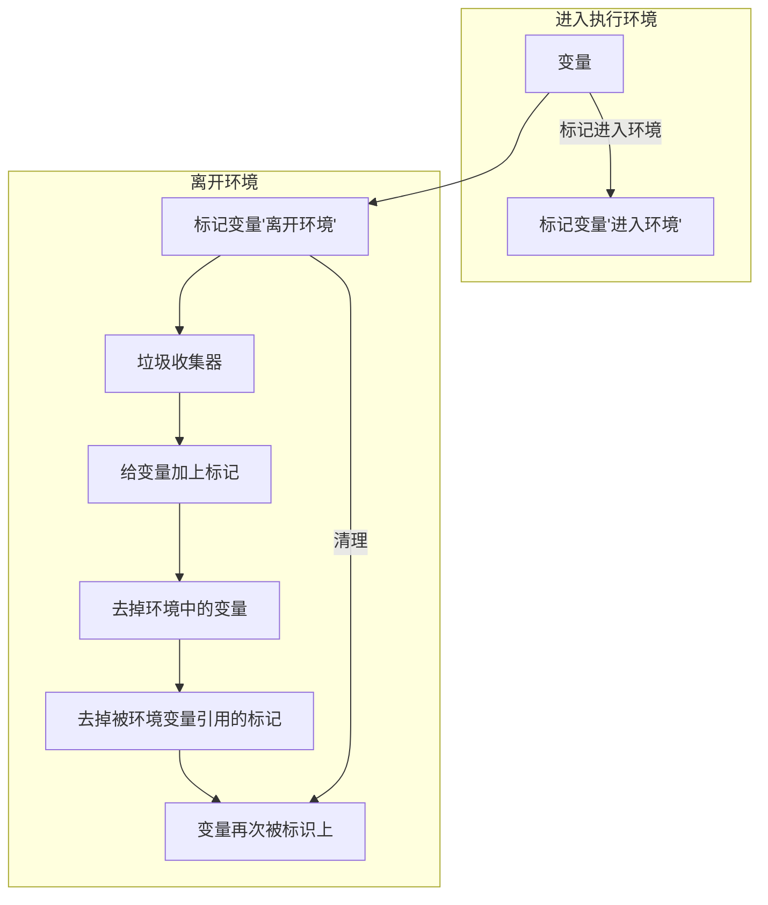

# `JavaScript面试题`

## 数据类型类

### 数据类型的介绍

+ 原始类型

  + `undefined`

  + `null`

  + `String`

  + `BigInt`：可以表示任意大小的整数

  + `Symbol`:表示独一无二的值，用于定义对象的唯一属性

  + `Number`

  + `Boolean`

+ 对象类型

  + `Object`
    + `基本Object`
    + `Array`
    + `Function`

一般**值类型(基本数据结构)**都是存放在**栈空间**里面的

```javascript
let a = 1;
let b = a;
a =2;
console.log(b)//1
```

一般**引用类型**都是存放在**堆空间**里面的，在**栈**里面存放的是**内存地址**，具体的值，我们需要去对应的**堆空间**的对应地址去取值

```javascript
let a= ={age:20}
let b = a;//他们用的是一个内存地址
b.age = 30;
console.log(a.age)//30
```


### 数据类型的判断

1. `typeof`

   > 只能判断所有的**值类型，函数**，不可以对**null，对象，数组**进行精准判断，因为他们只会返回**Object**
   
   **除函数外所有的引用类型都会被判定为`object`**

```javascript
typeof undefined //undefined
typeof Number//Number
typeof function(){}//function
typeof 12345689n//bigInt
typeof Symbol("foo")//Symbol
typeof true//Boolean
//不可判断,数组，对象，null
typeof null//Object
typeof []//Object
typeof {}//Object
```

2. `instanceof`

   > 能判断**对象类型**，不可以判断基本数据类型
   >
   > **其内部是在判断原型链上能否找到该类型的原型**

```javascript
class People {}
class Student extends People {}
const vortesnail = new Student();
console.log(vortesnail instanceof People); // true
console.log(vortesnail instanceof Student); // true
//顺着原型链，可以找到的，我们都返回true
```

3. `Object.prototype.toString.call()`

   > 所有的原始数据都可以判断
   >
   > 它还可以判断**Date对象**或者**Error对象**

```javascript
Object.prototype.toString().call(2);//"[object NUmber]"
Object.protutype.toString().call("");//"[object String]"
Object.prototype.toString.call(true); // "[object Boolean]"
Object.prototype.toString.call(undefined); // "[object Undefined]"
Object.prototype.toString.call(null); // "[object Null]"
Object.prototype.toString.call(Math); // "[object Math]"
Object.prototype.toString.call({}); // "[object Object]"
Object.prototype.toString.call([]); // "[object Array]"
Object.prototype.toString.call(function () {}); // "[object Function]"
```

**如何判断变量为数组**

```javascript
Object.prototype.toString().call(arr);//[object Array]
//使用instanceOf
arr instanceOf Array //true
//使用isArray()
Array.isArray(arr)//true
//在原型上找
arr.__prototype__ === Array//true
```

### 为什么区分原始数据类型和对象类型

##### 不可变性

> 原始类型，当他们被赋值以后，值本身就不会改变

```javascript
var str = 'summer';
str.slice(1);//他只会提取某个字符串的一部分，并返回新的字符串，不会改变原字符串
str.substr(1);//弃用
str.trim();//删除两头的空白字符串
str.toLowerCase();//变为小写
str[0] = 1;//直接赋值
console.log(str)//summer，不会改变值
```

**我们调用的方法，都会在原来的基础上生成一个新的字符串，而不是直接去改变字符串**

```javascript
str += '6'
console.log(str);  // summer6
```

原理：

执行`str+=6`的操作，实际上是在栈中又开辟了一块内存空间用于存储`summer6`,然后将变量`str`指向这块空间

在`javascript`中每一个变量都需要一个空间来存储

内存空间分为两种：`堆内存`和`栈内存`

**栈内存**

+ 栈内存的值大小固定：因为**栈内存空间大小固定**，所以**栈里面的变量就是不可变的**
+ 空间较小
+ 可以直接操作其保存的值
+ 系统自动分配存储空间

**JavaScript中原始类型的值全部都在栈内存中，在定义变量的时候，就一个分配好了空间**

**堆内存**

+ 存储的值可以动态调整
+ 空间较大，运行效率低
+ 无法直接操作内部存储，使用引用地址读取
+ 通过代码进行分配空间：栈内存的值表示的就是堆内存的空间地址

**引用类型的值实际上是存储在堆内存里面的，他在栈中只是存储里堆内存里面的地址，这个地址指向的是堆内存的值**

```javascript
var obj1 = {name:"ConardLi"}
var obj2 = {age:18}
var obj3 = function(){...}
var obj4 = [1,2,3,4,5,6,7,8,9]
```


引用类型不具有`不可变性`,所有有很多方法都可以改变他们

```javascript
obj1.name = "ConardLi6";
obj2.age = 19;
obj4.length = 0;
console.log(obj1); //{name:"ConardLi6"}
console.log(obj2); // {age:19}
console.log(obj4); // []
```

| pop()     | 删除数组的最后一个元素，改变原数组，返回被删除的元素         |
| --------- | ------------------------------------------------------------ |
| push()    | 向数组末尾添加一个或多个元素，该百年原数组，**返回新数组的长度** |
| shift()   | 将数组的第一个元素删除，改变原数组，**返回删除的元素**       |
| reverse() | 颠倒数组中元素的顺序，改变原数组，**返回改变后的数组**       |
| sort()    | 对数组元素进行排序，改变原数组，返回该数组                   |
| unshift() | 在数组的开头添加一个或者多个元素，改变原数组，**返回数组的长度** |
| splice()  | 从数组的添加/删除项目，改变原数组，**返回被删除的元素**      |

##### 复制

原始类型

```javascript
var name = 'summer';
var name2 = name;
name2 = 'code秘密花园';
console.log(name); //summer;
```

内存中有一个变量`name`,值为`summer`。我们从变量`name`复制出一个变量`name2`,这时候内存中创建了一个新的空间，用于存储`summer`

虽然两者值都是相同的，但是两者指向的内存空间完全不同

```javascript
var obj = {name:'ConardLi'};
var obj2 = obj;//复制的是obj的栈中存储的地址
obj2.name = 'code秘密花园';
console.log(obj.name); // code秘密花园
```


当我们复制引用类型的变量时，实际上复制的是栈中存储的地址，所以复制的是栈中存储地址。所以我们改变其中国的任何一个变量，另一个变量也会受到影响。

##### 比较

```javascript
var name = 'ConardLi';
var name2 = 'ConardLi';
console.log(name === name2); // true
var obj = {name:'ConardLi'};
var obj2 = {name:'ConardLi'};
console.log(obj === obj2); // false
```

+ 对于原始类型，比较时会直接比较它们的值，如果相等，就返回`true`
+ 对于引用类型，比较时比较的是他们的**引用地址**。虽然两个变量在堆中存储的对象具有属性值都是相等的，但是它们被存储在不同的存储空间，因此比较值为`false`

##### 值传递和引用传递

```javascript
let name = 'summer';
function changeValue(name){
  name = 'code秘密花园';
}
changeValue(name);
console.log(name);//summer
```

函数打印出来的值**没有改变**，说明函数**参数传递的是变量的值**，即值传递

函数内部的操作可以改变传入的变量，那么**说明函数参数传递的是引用**，即引用传递

**这个并不是引用传递**

```javascript
let obj = {name:'summer'};
function changeValue(obj){
  obj.name = 'code秘密花园';
}
changeValue(obj);
console.log(obj.name); // code秘密花园
```

**JavaScript中所有函数的参数都是值传递**

当**函数参数为引用类型**的时候，我们同样将参数复制了一个副本给局部变量，只不过复制的这个副本是指向**堆内存的地址**，我们在函数内部对对象的属性进行操作，实际上和外部变量指向堆内存中的值相同

**当变量是原始类型时，这个副本就是值本身，当变量是引用类型时，这个副本是指向堆内存的地址**

#### `null`和`undefined`

`null`

表示被赋值过的对象，刻意把一个对象赋值为`null`

对象的某个属性值为`null`是正常的，`null`转为数值时为`0`

`undefined`

表示缺少值，此处有一个值，但是没有定义

`undefined`转为数值时为`NaN`

#### `Symbol`类型

`Symbol`特性

1. 独一无二

直接使用`Symbol()`创建`Symbol`变量

```javascript
let sym1 = Symbol();//Symbol()
let sym2 = Symbol('summer');//(Symbol(summer))
let sym3 = Symbol('summer');//(Symbol(summer))
let sym4 = Symbol({name:'summer'})
console.log(sum2 === sym3)//false,说明他创造的是独一无二的
```

**如果想要创造两个相同的`Symbol`变量，那么需要使用`Symbol.for(value)`**

```javascript
var sym1 = Symbol.for('summer');
var sym2 = Symbol.for('summer');
console.log(sym1 === sym2); // true
```

2. 他是基本数据类型

> 基本数据类型，不可以使用new关键词进行构造函数

3. 不可枚举

> 不可以使用`for..in`不能将其枚举

#### `Number`类型

1. 精度丢失

计算机中所有的数据都是`二进制`存储的，所以计算机都会先转换为`二进制`进行计算，然后再转换为`十进制`

2. JavaScript对二进制小数的存储方式
   + **小数的二进制大多数都是无限循环**
   + `JavaScript`中的`Number`是64位

#### 引用类型

`Object`

+ `Array`数组
+ `Date`日期
+ `RegExp`正则
+ `Function`函数

#### 类型转换


##### `if`语句和逻辑语句

以下情况转换为`false`其他都会转变为`true`

```javascript
null
undefined
''
NaN
0
false
```

##### 运算

**对于非`Nymber`类型运用数学运算符，会先将非`Number`转换为`Number`**

`+`运算符

+ 当一侧为`String`，那么就会认为是字符串的拼接
+ 当一侧为`Number`，里面一侧是一个基本类型，那么就会将基本类型转换为`Number`类型，进行做加法
+ 当一侧为`Number`,另一侧为引用类型，将引用类型和`Number`类转为字符串，然后进行拼接

```javascript
123+'123' = '123123'
123+null = 123//null的Number是0
123+true = 124
123+{} = 123[object object]
```

##### `==`

+ 两侧类型相同

> 会发生隐式转换

1. `NaN`

**NaN和其他任何类型比较永远返回`false`(包括和他自己)**

`NaN`和任何类型都不相同

2. `Boolean`

`Boolean`和任何类型相比，`Boolean`优先会被转化为`Number`类型

```javascript
true == 1  // true 
true == '2'  // false
true == ['1']  // true
true == ['2']  // false
```

**注意**

```javascript
undefined == false // false
null == false // false
//原因：
//==和Boolean进行比较时，Boolean都会优先判断
//undefined == false，false先变为0，但是这边nudefined没有转换为Number
```

3. `String`和`NUmber`

> `String`和`Number`进行比较，先将`String`转换为`Number`

```javascript
123 == '123' // true
'' == 0 // true
```

4. `null`和`undefined`

**`null`和`undefined`比较，都为false(不包括和自身进行比较)**

**`null`和`undefined`比较结果为`true`**

```javascript
null == undefined // true
null == '' // false
null == 0 // false
null == false // false
undefined == '' // false
undefined == 0 // false
undefined == false // false
```

+ 双方类型不同

  >  原始类型和引用类型进行比较

  **对象类型(引用类型)会被转化为原始类型**

```javascript
  '[object Object]' == {} // true
  '1,2,3' == [1, 2, 3] // true
```

```javascript
[] == ![] // true
原因：
!的权限高，![]会优先转为false，false是Boolean，也会优先转化为0，然后[]为0，所以相同
```

```javascript
[null] == false // true
[undefined] == false // true
原因
数组元素为null或者undefined时，该元素会被当作空字符串进行比较，所以[null]和[undefind]都会被转化为0
```

#### 深拷贝和浅拷贝

浅拷贝

> 如果属性是**基本类型**，拷贝的就是**基本类型的值**，如果属性是**引用类型**，拷贝的就是**内存地址** ，所以如果其中一个对象改变了这个地址，就会**影响到另一个对象。**

深拷贝

> 将一个对象**从内存中完整的拷贝**一份出来,从堆内存中开辟一个新的区域存放新对象,且**修改新对象不会影响原对象**

赋值

> 赋值赋的是该**对象在栈中的地址**
>
> 两个对象指向的是**同一个存储空间**，无论哪个对象发生改变，其实都是改变的存储空间的内容，因此，**两个对象是联动**的。

```javascript
//赋值
// 对象赋值
 var obj1 = {
    'name' : 'summer',
    'age' :  '18',
    'language' : [1,[2,3],[4,5]],
};
var obj2 = obj1;
obj2.name = "summer22";
obj2.language[1] = ["二","三"];
console.log('obj1',obj1)
console.log('obj2',obj2)
```


这边无论是基本类型还是引用类型都发生了变化

```javascript
// 浅拷贝
 var obj1 = {
    'name' : 'summer',
    'age' :  '18',
    'language' : [1,[2,3],[4,5]],
};
 var obj3 = shallowCopy(obj1);
 obj3.name = "summer22";
 obj3.language[1] = ["二","三"];
 function shallowCopy(src) {
    var dst = {};
    for (var prop in src) {
        if (src.hasOwnProperty(prop)) {
            dst[prop] = src[prop];
        }
    }
    return dst;
}
console.log('obj1',obj1)
console.log('obj3',obj3)
```


这边基本类型没有发生变化但是引用类型发生了变化，**因为对于引用类型，他拷贝的就是内存的地址**


浅拷贝代码

```javascript
function clone(target){
    let cloneTarget = {};
    for(const key in target){
        cloneTarget[key] = target[key]
        //cloneTarget.key = target.key
    }
    return cloneTarget
}
```

深拷贝

+ 如果为原始类型，不需要拷贝，直接返回
+ 如果为引用类型，那么就需要创建一个对象，一个一个的拷贝过去，直到变为原始类型
+ 但是为了防止存在自身调用自身的情况，所以我们需要额外开辟一个空间，用来判断这个对象是否已经拷贝过了，使用map来判断

```javascript
function clone(target,map = new WeakMap()){
    //首先判断类型
    if(typeof target === 'object'){
        //需要新建一个对象，然后一个一个的拷贝进去
        //let cloneTarget = {}
        //判断他是不是已经拷贝过了
        let cloneTarget = Array.isArray(target) ? [] : {}
        if(map.has(target)){
            return map.get(target)
        }
        //否则的话，将他存入map
        map.set(target,cloneTarget)
        for(const key in target){
            cloneTarget[key] = clone(target[key])
        }
        return cloneTarget
    }else{
        return target
    }
}
```

`WeakMap`

> 也是一组键/值对的集合，键必须要是一个对象，但是值可以是任何类型，它是一种弱引用

`弱引用`

一般情况下，`const obj = {}`,我们就会创建一个强引用的对象，**只有我们手动将他设置为null`obj = null`,它才会进入垃圾回收**，但是如果是**弱引用**的话，**垃圾回收会自己帮我们回收**

假如上面我们的要拷贝的对象很庞大时，`map`就会对内存造成消耗(内存溢出)，我们必须手动的清除`map`的引用，才能释放掉这块内存

### 内存类

#### 垃圾回收

> **找到不再使用的变量，然后释放掉其占用的内存**，但是过程**不是实时**的，因为他的开销比较大，所以，它是**按照一个固定的周期**执行的

```javascript
var a = "hello";//hello被a引用了
var b = "summer";//summer被b引用了
var a = b; //重写a
```

这边，代码对`a`进行了重写，那么`hello`这个字符串就会失去引用。系统检测到就会释放该字符串的空间以便这些空间可以再次被利用

##### 垃圾回收机制

> 如何知道哪些内存是不需要的

+ 标记清除(常用)
+ 引用计数

1.标记清楚



2. 引用计数

> 就是有一张引用表，保存着内存中的所有资源的引用次数。
>
> 如果这个表的引用次数为0，那么就表示这个值不会用到了，就是释放

**如果一个值不会使用了，但是引用数却不为0，那么垃圾回收机制就会无法释放这个内存，导致内存泄漏**

```javascript
let arr = [1,2,3];//[1,2,3]被arr引用，所以应用数加1
arr = [a,c,b];
//[a,c,b]被arr引用，[a,c,b]引用数加1，但是[1,2,3]失去引用，所以引用数减1，变为0
//垃圾回收机制，会将[1,2,3]的内存释放掉，但是，因为[a,c,b]的引用值不为0，所以无法回收
console.log("summer")
```

问题

> 循环引用问题

```javascript
function func{
    let obj1 = {};
    let obj2 = {};
    obj1.a = obj2;//obj2被obj1引用
    obj2.b = obj1;//obj1被obj2引用
    //当这个函数被回收后，里面的对象obj1和obj2，因为引用值不为0，所以无法回收
    //如果需要解决可以赋值为null
    obj1 = null;
	obj2 = null;
}
```

##### 引起内存泄漏

>内存泄漏：垃圾回收器一直无法回收“进入环境”的变量

1. 全局变量

```javascript
function foo(arg){
	bar = "summer"
    //这里bar没有进行声明，bar变为一个全局变量，'summer'直接被全局变量bar引用
    //直到页面关闭之前都不会被释放
}
```

`this`引起的全局变量

```javascript
function foo(){
	this.bar = 'summer'
    //因为this，是指向window的，所以只有当页面关闭，才会释放
}
foo()
```

**加上`use strict`，可以避免这种问题**

2. 计数器或者回调函数

```javascript
var someResource = getData();
setInterval(function() {
    var node = document.getElementById('Node');
    if(node) {
        // 处理 node 和 someResource
        node.innerHTML = JSON.stringify(someResource));
    }
}, 1000);
```

如果`id`为`Node`的元素从`DOM`中移除，定时器还是会存在，同时因为回调函数中包含对`someResource`的使用，所以定时器外边的`someResource`也不会被释放

3. 闭包

```javascript
function bindEvent(){
  var obj=document.createElement('xxx')//document.XXXX被obj引用了，引用值为1
  obj.onclick=function(){
    // Even if it is a empty function
  }
    //obj再次引用了function，引用值加一，但是documentXXX没有引用，value-1，那么回收
    //整个函数清理掉后，因为函数的value不为1，所以一直不会清理
}
```

> 闭包可以维持函数内局部变量，使其得不到释放

```javascript
// 将事件处理函数定义在外面
function bindEvent() {
  var obj = document.createElement('xxx')
  obj.onclick = onclickHandler
}
// 或者在定义事件处理函数的外部函数中，删除对dom的引用
function bindEvent() {
  var obj = document.createElement('xxx')
  obj.onclick = function() {
    // Even if it is a empty function
  }
  obj = null
}
```

4. 没有清理的`DOM`元素引用

```javascript
var elements = {
    button: document.getElementById('button'),
    image: document.getElementById('image'),
    text: document.getElementById('text')
};
//将每一行DOM存为一个字典树或者数组
//同样的 DOM 元素存在两个引用：一个在 DOM 树中，另一个在字典中。
function doStuff() {
    image.src = 'http://some.url/image';
    button.click();
    console.log(text.innerHTML);
}
function removeButton() {
    document.body.removeChild(document.getElementById('button'));
    // 此时，仍旧存在一个全局的 #button 的引用
    // elements 字典树种，button 元素仍旧在内存中，不能被回收。
}
```

##### 避免内存泄漏

+ 减少不必要的全局变量，或者生命周期较长的对象，及时对无用的数据进行垃圾回收
+ 注意程序逻辑，避免“死循环”
+ 避免创造太多的对象

##### 垃圾回收使用场景优化

1. 数组`Array`优化

直接`arr = []`,可以起到清空数组的作用，但是，他也在堆空间上面重新创建了一个空间用于存储`空数组`，那么就会将原来的数组对象变为一个小的内存垃圾

我们可以采用`arr.length = 0`,也能达到清理数组的目的，并且同时实现数组的重用，减少内存垃圾

```javascript
let arr = [1,2,3];//[1,2,3]被arr引用，所以应用数加1
arr = [a,c,b];
//[a,c,b]被arr引用，[a,c,b]引用数加1，但是[1,2,3]失去引用，所以引用数减1，变为0
//垃圾回收机制，会将[1,2,3]的内存释放掉，但是，因为[a,c,b]的引用值不为0，所以无法回收
console.log("summer")
//我们可以
arr.length = 0;//可以上数字清空，并且数组类型不变
//arr = [];虽然也清空了，但是在堆上面有了一个新的空数组对象
```

2. 对象尽量复用

**对象尽量复用，不能用的尽量赋值为null**

```javascript
var t = {} // 每次循环都会创建一个新对象。
for (var i = 0; i < 10; i++) {
  // var t = {};// 每次循环都会创建一个新对象。
  t.age = 19
  t.name = '123'
  t.index = i
  console.log(t)
}
t = null //对象如果已经不用了，那就立即设置为null；等待垃圾回收。
```

3. 在循环中的函数表达式，最好放在外边，能复用最好复用

```javascript
// 在循环中最好也别使用函数表达式。
for (var k = 0; k < 10; k++) {
  var t = function(a) {
    // 创建了10次  函数对象。
    console.log(a)
  }
  //最好，将函数抽离出循环，就是函数的定义放到外边去
  t(k)
}
```

```javascript
// 推荐用法
function t(a) {
  console.log(a)
}
for (var k = 0; k < 10; k++) {
  t(k)
}
t = null
```